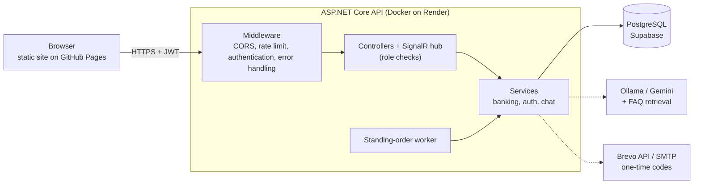

# SmartBank

[](https://github.com/Alonessam/SmartBank-/actions/workflows/ci.yml)
[](https://dotnet.microsoft.com/)
[](LICENSE)

**English** | [Türkçe](README.tr.md)

A simulated digital bank: an **ASP.NET Core (.NET 10) Web API** with a vanilla HTML/CSS/JS frontend. Multi-currency accounts, market rates, credit cards with statements, standing orders, rule-based fraud checks and an AI-assisted support chat with live agents.

> **Everything is simulated.** The money, the cards and the exchange rates are fake. It is not a real bank and it is not a regulated or PCI-certified product. Do not enter real personal data.

**Live demo:** <https://alonessam.github.io/SmartBank-/> (frontend on GitHub Pages). The API runs on a free tier, so the **first request after a quiet period takes about a minute** while the service wakes up.

## Try the demo

1. Open the live demo and choose **Register**.
2. Use any username, a 6-digit PIN, an e-mail address and a made-up T.C. Kimlik No with valid check digits, for example `11111111110` or `10000000146` (they belong to nobody).
3. Sign in. Your first TRY account is opened for you. Try a transfer, a currency purchase, a credit card or the support chat.

One-time codes (2FA, password reset) are e-mailed. They are shown on screen only when the API runs with `Demo__ExposeOtp=true`, which the public demo may use so the flow can be shown without a mailbox. The support-agent dashboard needs the `Agent` role, which only an administrator can grant (see [Create a support agent](#6-create-a-support-agent)).

## Quick start (Windows, SQL Server LocalDB)

Prerequisites: [.NET 10 SDK](https://dotnet.microsoft.com/download), and PowerShell for the helper scripts (a bash equivalent exists for Linux and macOS, see below).

```powershell
./scripts/dev-secrets.ps1                                   # one-time: random local keys into user-secrets
dotnet tool restore; dotnet ef database update --project src/SmartBank.Infrastructure --startup-project src/SmartBank.API
dotnet run --project src/SmartBank.API --launch-profile http   # API on http://localhost:5038
```

Then serve `src/SmartBank.Web` with any static server (VS Code *Live Server*, or `npx serve src/SmartBank.Web -l 5500`) and open it on `http://127.0.0.1:5500`. On Linux, macOS or without LocalDB, use the PostgreSQL route in [Setup](#1-database).

## What is new

* **1.3** (audit pass): money-correctness fixes, security hardening, frontend fixes, and repository, CI and Docker polish (CodeQL, SQL Server and Docker jobs in CI, a baseline PostgreSQL schema, docker-compose, community files). Details in [`CHANGELOG.md`](CHANGELOG.md).
* **1.2**: stored-XSS fix and a Content-Security-Policy, 15-minute access tokens with rotating refresh tokens, e-mail through Brevo's HTTPS API, support-chat limits and forged-transfer-card protection, API security headers, T.C. Kimlik No check digits, production schema fixes.
* **1.1**: security and reliability pass (role-based chat authorization, no secrets in the repository, AES-GCM card data, brute-force protection, concurrency-safe money movements). The reasoning behind each fix, with the alternatives that were rejected, is in [`docs/DEFENSE.md`](docs/DEFENSE.md) (Turkish, English summary at the top).

---

## Features

### 1. Multi-currency assets
* **Wallets:** fiat accounts (**TRY, USD, EUR**) and precious metals (**Gold - XAU, Silver - XAG**).
* **Account closing with balance transfer:** closing an account that still holds money asks for a destination account; the remaining funds are converted at the current rates and the account is closed.
* **No-zero policy:** a user always keeps at least one active account.
* **Time deposit tiers:** a TRY time-deposit account shows a tiered annual interest rate and a maturity date. The interest is **displayed only**: nothing accrues it (see Known limitations).

### 2. Currency and metal trading (buy/sell)
* The rate and the final cost update as the user types the amount.
* Buying a currency or metal opens the matching wallet automatically.
* The rates come from a third-party feed with simulated fallback prices (see Known limitations).

### 3. Credit card workspace
* **Single-card rule:** at most one credit card per user.
* **Visual card customizer:** four themes (Neon Blue, Sunset Orange, Metallic Dark, Glassmorphism); the cardholder name scales to fit.
* **Statements and debt:** billing-period statements, minimum payment, paying the debt from a chosen account.
* **Standing orders:** scheduled bill payments, and an automatic card-debt payment.

### 4. Saved contacts and quick transfers
* Save recipients by account number (IBAN), edit their aliases or delete them.
* Pick a saved contact to fill the transfer form.

### 5. AI support chat and agent co-pilot (SignalR)
* **Hybrid support:** real-time chat over SignalR. A bot (FAQ retrieval plus Ollama locally or Gemini) answers first and can hand the conversation to a live agent.
* **Agent workspace:** live chat queue, average response time, resolution metrics, availability toggle.
* **Co-pilot:** the AI suggests quick replies to the agent.

---

## Architecture



Layers: `SmartBank.Core` (entities, DTOs, interfaces and the pure security rules for one-time codes and lockout), `SmartBank.Infrastructure` (EF Core, services, background worker), `SmartBank.API` (controllers, SignalR hub, middleware), `SmartBank.Web` (static frontend) and `SmartBank.Tests`. More detail, including the authentication flow and the deployment topology, in [`docs/ARCHITECTURE.md`](docs/ARCHITECTURE.md).

### Design notes
1. **Caching (Decorator + memory cache).** `CachedMarketRateService` wraps the HTTP-based `MarketRateService` without changing its callers (open-closed principle). Rates are cached in `IMemoryCache` for **5 minutes**, which cuts latency and protects against the third-party feed's limits.
2. **Hosted background service.** `StandingOrderExecutionWorker` (a `BackgroundService`) wakes every 30 seconds, finds due orders and executes each in its own scope and database transaction. An order runs exactly once even if several workers or a customer's transfer touch the same rows. A collision does not deactivate the order, it is retried on the next cycle; only a real failure deactivates it.
3. **Audit trail.** Sensitive actions (registration, sign-in, failed sign-in and lockout, password reset, transfers, exchange, account closing) are written to an `AuditLogs` table with a detail text, the caller's real IP address and a timestamp. The application only inserts audit rows, but the database does not enforce it: append-only by convention, **not tamper-proof**.
4. **Global exception middleware (RFC 7807-style problem details).** Unhandled exceptions become problem-details JSON (`type`, `title`, `status`, `detail`, `instance`) plus a `traceId`. Outside Development the `detail` is generic and the real exception goes to the log.
5. **Validation (FluentValidation).** `RegisterDtoValidator` and `TransferRequestDtoValidator` hold the request rules (T.C. Kimlik No check digits, 6-digit PIN, amount range) apart from the business logic.
6. **Concurrency-safe money movement (optimistic concurrency).** `Account` and `CreditCard` carry an integer `Version`; every update is `WHERE Id = @id AND Version = @read`. If the row changed in between, nothing is written and the operation is repeated from fresh reads (up to 10 times, with a short random back-off). SQL Server deadlock victims and PostgreSQL serialization failures are retried the same way. A plain integer behaves the same on both databases, unlike `rowversion` or `xmin`. Before v1.1 this race created money out of thin air.
7. **Automated tests** (xUnit, Moq, WebApplicationFactory, SignalR client; several hundred tests):
   * *Unit tests:* pure rules (one-time codes, lockout, encryption, CORS policy, error middleware) and services against EF Core's in-memory provider.
   * *Real-database tests:* concurrent transfers, deposits and card charges, the standing-order worker and the PostgreSQL upgrade scripts run against PostgreSQL and/or SQL Server (the in-memory provider cannot reproduce races). CI runs them on both.
   * *Integration tests:* the whole application is started in memory and driven over HTTP and SignalR: roles, chat endpoints, the hub and cross-customer access to accounts and cards (IDOR).
   * *Guards:* a test fails on double-encoded Turkish text in any source file; CI fails on skipped tests, vulnerable NuGet packages, `System.Random` in security code, a JavaScript syntax error, a model change without a migration, and a Docker image that does not build.

---

## Technology stack

* **Backend:** .NET 10 (C#), EF Core, SignalR, BCrypt.NET, FluentValidation. **PostgreSQL in production, SQL Server LocalDB or PostgreSQL for local development**
* **Frontend:** semantic HTML5, vanilla CSS3 (custom properties, keyframes, glassmorphism), ES6+ JavaScript, Chart.js
* **AI:** Ollama (Llama 3, local) and the Gemini API, with FAQ retrieval (RAG)
* **Testing:** xUnit, Moq, EF Core InMemory, `Microsoft.AspNetCore.Mvc.Testing`, SignalR client; PostgreSQL and SQL Server for the real-database tests
* **Delivery:** Docker, GitHub Actions (build, tests on PostgreSQL and SQL Server, dependency audit, CodeQL, Docker build), Dependabot

---

## Deployment

* **Frontend (GitHub Pages):** <https://alonessam.github.io/SmartBank-/>, published from the `gh-pages` branch by `scripts/deploy-pages.ps1` (or `.sh`).
* **API (Render, Docker):** `https://smartbank-fintech-api.onrender.com`, built from the root `Dockerfile`. Set the service's health-check path to `/health`.
* **Database (Supabase PostgreSQL):** through the session connection pooler.

To deploy your own copy: create an empty PostgreSQL database and run [`docs/deploy/00-baseline-postgres.sql`](docs/deploy/00-baseline-postgres.sql); create a Render *Web Service* from the repository with the Docker runtime and set the environment variables from the [table below](#2-configure-secrets); then publish the frontend with the deploy script. The frontend talks to a hard-coded API address (`API_URL` in `src/SmartBank.Web/app.js` and the hub URL in `chat.js`): change both for a fork, and put the Pages origin into `Cors__AllowedOrigins__0`.

### Upgrading a PostgreSQL deployment

The production tables were created by hand, so the application does **not** migrate the database (`MigrateAsync` is off behind Supabase's pooler). Upgrade scripts live in [`docs/deploy`](docs/deploy). Run them **in order, once each, before deploying the matching API version**:

1. [`v1.1-postgres-upgrade.sql`](docs/deploy/v1.1-postgres-upgrade.sql): card hardening (the CVV is no longer stored; card numbers stored by v1.0 cannot be decrypted under the new key), lockout and one-time-code columns, concurrency versions, roles.
2. [`v1.2-postgres-upgrade.sql`](docs/deploy/v1.2-postgres-upgrade.sql): the `RefreshTokens` table and schema fixes (`ChatSessions.IsActive`, nullable `StandingOrders.Amount`, `timestamptz` columns).
3. [`v1.3-postgres-upgrade.sql`](docs/deploy/v1.3-postgres-upgrade.sql): the v1.3 changes.

[`schema-check.sql`](docs/deploy/schema-check.sql) lists every production column so you can compare it with what the code expects. A **fresh** database is created from the baseline script instead and needs none of the upgrade scripts. Each release's steps are in [`CHANGELOG.md`](CHANGELOG.md).

---

## Security model

| Risk | What the code does |
|---|---|
| Secrets in the repository | JWT and encryption keys come from user-secrets or environment variables; the API refuses to start without them (fail fast). |
| Card data | AES-256-GCM with a random nonce per value (tampering is detected). Card duplicates are found through a keyed HMAC. The CVV is **never stored**; it is shown once when a card is issued. |
| Guessing a PIN or a one-time code | 5 wrong PINs lock the account for 15 minutes; a one-time code dies after 5 wrong guesses, expires after 5 minutes, is single-use and bound to its purpose (and, for transfers, to the exact amount and recipient). Per-IP rate limits on the auth endpoints. Unknown T.C. numbers and wrong PINs get identical answers, and while an account is locked the API answers with the same generic `InvalidCredentials` message as for a wrong PIN, so the lockout itself is not revealed. |
| Account takeover | Password reset needs a code e-mailed to the owner; the 2FA code is not returned by the API (unless the demo flag is on). |
| Typos in the identity number | Registration checks the T.C. Kimlik Numarası check digits (server and form). This is a format check, **not** identity verification (that needs MERNIS). |
| Browser-side attacks on the API | Every response has `nosniff`, `X-Frame-Options: DENY`, a `default-src 'none'` CSP and `no-referrer`; `/api` responses are `no-store`; HSTS is sent over HTTPS in production. |
| A stolen token | Access tokens live 15 minutes. The refresh token is single-use (rotated on every refresh, stored only as a hash); presenting a used one again revokes the whole session. Logout and password reset end every session. Failed sign-ins and lockouts do not: otherwise anyone who knows a T.C. number could keep signing its owner out. |
| Who may do what | Roles live in the database and in the token. Customers reach only their own accounts, cards and chats; support-agent endpoints and hub methods need the `Agent` role, which only an administrator can grant. Verified with cross-customer (IDOR) integration tests. |
| Browser access | CORS accepts only the origins listed in configuration. |
| Concurrent requests | Optimistic concurrency with retry on every money movement. |
| Information leaks | Errors return a generic message and a trace id; details go to the log. |

## Known limitations

SmartBank is a portfolio project with a simulated bank. In particular:

* **The `deposit` endpoint is a demo faucet.** Any signed-in user can add money to their own account (up to 10,000,000 TRY). A real system has nothing like it. `Demo__EnableSimulationEndpoints=false` switches off the other demo-only helpers (credit-card test charges and the statement-period advance), but not the faucet.
* **Access tokens cannot be revoked, only outlived.** They last 15 minutes and are renewed by a single-use refresh token, which *is* revoked on logout and password reset; a role change (done by hand in SQL) only takes effect at the next refresh. Both tokens are kept in `localStorage`, so a cross-site-scripting bug would expose them. Every value that comes from another user is HTML-escaped before it reaches the page and the pages carry a Content-Security-Policy without inline scripts, but a `<meta>` CSP cannot set `frame-ancestors` and any future XSS bug would still be able to read the token.
* **The rate limiter is per instance.** Behind several instances the limit is not shared (that would need a shared store or a gateway).
* **One-time codes are stored in plain text** in the database for their five-minute life (hashing them is the production choice).
* **Cards are simulated:** numbers carry no check digit, the credit card number is returned in full by the API (the UI masks it), and nothing here is PCI-certified.
* **The audit trail is append-only by convention**, not tamper-proof (see above).
* **Registration reveals whether a username, a T.C. number or an e-mail address is already taken.**
* **Market rates are a third-party scrape with simulated fallback prices.** `MarketRateService` reads an unofficial public JSON feed; when it is unreachable the service invents prices (a small random drift around fixed values), and those prices are used for currency purchases and sales.
* **Time deposit interest is displayed, not accrued.** The tiered rate and the maturity date are shown, but no job ever adds interest to the balance.
* **The AI chat:** the model sees only the conversation and, on request, the balances of the session's own owner, and it can only *propose* a transfer that the customer must confirm (the transfer itself goes through the normal ownership, limit and one-time-code checks). What remains: the text and those balances are sent to an external model provider (Gemini when the local Ollama is down), and a user can still talk the model into odd answers in their own chat (prompt injection), which is why nothing the model writes is trusted as a command.
* **Two database providers.** The EF migrations target SQL Server; production is PostgreSQL, created from a generated baseline script and upgraded with hand-run scripts (tested against a real PostgreSQL). A single-provider setup would be cleaner.

---

## Setup and configuration

### Prerequisites

* [.NET 10 SDK](https://dotnet.microsoft.com/download) (`global.json` pins the SDK band).
* `dotnet tool restore` installs `dotnet-ef` from `.config/dotnet-tools.json`; no global install is needed.
* PowerShell is optional: `scripts/dev-secrets.sh` and `scripts/deploy-pages.sh` do the same on Linux and macOS.
* Docker is optional: `docker-compose.yml` starts a local PostgreSQL (and, on request, the API).
* Node.js is optional (only to syntax-check the frontend scripts or to use `npx serve`).

### 1. Database

The API validates its secrets at startup and `dotnet ef` starts the API to find the `DbContext`, so run `./scripts/dev-secrets.ps1` first (step 2).

**SQL Server LocalDB (Windows).** `appsettings.json` defaults to LocalDB:
```bash
dotnet tool restore
dotnet ef database update --project src/SmartBank.Infrastructure --startup-project src/SmartBank.API
```

**PostgreSQL (any OS).** The connection string decides the provider: a string containing `Host=` selects PostgreSQL.
```bash
docker compose up -d db
docker compose exec -T db psql -U postgres -d smartbank < docs/deploy/00-baseline-postgres.sql
```
```powershell
$env:ConnectionStrings__DefaultConnection = "Host=localhost;Port=5432;Database=smartbank;Username=postgres;Password=postgres"
```
(`export ConnectionStrings__DefaultConnection=...` in bash.) In PowerShell, which has no `<` redirection, load the baseline with `Get-Content docs/deploy/00-baseline-postgres.sql | docker compose exec -T db psql -U postgres -d smartbank`. The baseline script is generated from the EF model and creates a fresh database; see its header for how to regenerate it. For an existing production database use the upgrade scripts described under [Deployment](#upgrading-a-postgresql-deployment).

### 2. Configure secrets
Secrets are **never** stored in `appsettings.json`. The API refuses to start without a JWT signing key and an encryption key.

**Local development** (uses .NET user-secrets, nothing is written to the repository):
```powershell
./scripts/dev-secrets.ps1        # Linux/macOS: ./scripts/dev-secrets.sh
```
This generates random values for `JwtSettings:Key` and `Encryption:Key` (`-Rotate` / `--rotate` replaces existing ones). To add a Gemini key: `dotnet user-secrets set GeminiSettings:ApiKey <your-key> --project src/SmartBank.API`.

**Production** (e.g. Render): set environment variables. Nested settings use a double underscore (`Section__Key`).

| Variable | Description |
|---|---|
| `JwtSettings__Key` | JWT signing key, at least 32 bytes (e.g. 48 random bytes, base64). **Required** |
| `JwtSettings__Issuer`, `JwtSettings__Audience` | Optional. Token issuer and audience (defaults `SmartBankAPI` and `SmartBankApp`) |
| `JwtSettings__AccessTokenMinutes`, `JwtSettings__RefreshTokenDays` | Optional. Access token lifetime (default 15, 1-1440) and refresh token lifetime (default 7, 1-90). Out-of-range values stop the API from starting |
| `Encryption__Key` | AES-256 key, base64 of exactly 32 random bytes. **Required** |
| `ConnectionStrings__DefaultConnection` | Database connection string (`Host=...` selects PostgreSQL, otherwise SQL Server) |
| `GeminiSettings__ApiKey`, `GeminiSettings__Model` | Optional. Gemini API key; model name (default `gemini-2.5-flash`) |
| `OllamaSettings__BaseUrl`, `OllamaSettings__Model` | Optional. Local Ollama server (defaults `http://localhost:11434` and `llama3`). Not available on Render; the chat then uses Gemini |
| `Brevo__ApiKey`, `Brevo__SenderEmail`, `Brevo__SenderName` | **Recommended on Render.** E-mails one-time codes through the [Brevo](https://www.brevo.com) HTTPS API (free tier: 300 mails/day). `SenderEmail` must be a sender address verified in Brevo; the API refuses to start if only the key is set. `SenderName` defaults to "SmartBank Güvenlik". Free hosts block SMTP ports, which is why this goes over HTTPS. A free-mail sender such as `@gmail.com` cannot be signed by Brevo, so some providers may put the mail in spam |
| `SmtpSettings__Host`, `__Port`, `__Username`, `__Password`, `__EnableSsl`, `__FromAddress` | Plain SMTP, used only when `Brevo__ApiKey` is not set (local development, or a host that allows SMTP). With neither Brevo nor `Host`, no e-mail is sent and **password reset cannot be completed** |
| `Demo__ExposeOtp` | `false` by default. If `true`, 2FA/transfer codes are also returned in API responses and written to the log so the demo works without a mailbox. **This removes the value of the second factor. Never enable it where real data lives.** The local `http`/`https` launch profiles enable it |
| `Demo__EnableSimulationEndpoints` | `true` by default. Set to `false` to switch off the demo-only simulation endpoints (the credit-card test charge and the statement-period advance; the deposit faucet stays) |
| `RateLimiting__Auth__PermitLimit`, `__WindowSeconds` | Per-IP limit on `/api/auth/*` (default 10 requests per 60 s) |
| `RateLimiting__Refresh__PermitLimit` | Per-IP limit on token refresh and logout (default 60 per minute) |
| `RateLimiting__Banking__PermitLimit` | Per-user limit (per IP when the caller is not identified) on the banking endpoints (default 60 per minute) |
| `RateLimiting__Transfer__PermitLimit` | Per-user limit on money-moving calls: transfer, exchange, deposit and card payment (default 10 per minute); replaces the banking limit for those calls |
| `RateLimiting__Market__PermitLimit` | Per-IP limit on the public market-rates endpoint (default 60 per minute) |
| `Chat__MessagesPerMinute`, `Chat__MessagesPerHour`, `Chat__SessionsPerHour`, `Chat__TransfersPerMinute` | Per-user support-chat limits (defaults 10, 100, 10 and 5; agents get three times the per-minute allowance). Whole numbers from 1 to 100000 |
| `Cors__AllowedOrigins__0`, `__1`, ... | Browser origins allowed to call the API (default `https://alonessam.github.io`). Anything else is rejected. In Development, pages opened from disk and `localhost` are also accepted |
| `ASPNETCORE_ENVIRONMENT` | `Production` by default in the container; `Development` enables detailed errors, OpenAPI and the local CORS rules |

Health endpoints: `GET /health` (liveness, touches nothing) and `GET /health/ready` (readiness, checks the database). Both answer only `Healthy`/`Unhealthy`; point the platform's health check at `/health`.

Behind a reverse proxy (Render, etc.) the container image sets `ASPNETCORE_FORWARDEDHEADERS_ENABLED=true` so the rate limit and the audit log see the real client IP. Do not expose that image directly to the internet.

### 3. Run the backend API
```bash
dotnet run --project src/SmartBank.API --launch-profile http
```
The API listens on `http://localhost:5038`. On Windows, `baslat.bat` in the repository root creates the secrets and starts the API in one go. With Docker: `docker compose --profile api up` builds the image and starts it with the database on `http://localhost:8080` (create the tables first, see step 1).

### 4. Run the client portal
Serve `src/SmartBank.Web` from a local web server, for example VS Code's **Live Server** (right-click `index.html`, *Open with Live Server*, usually `http://127.0.0.1:5500`) or `npx serve src/SmartBank.Web -l 5500`.

> **Do not open `index.html` straight from disk.** A page opened from a file has no host name, so `app.js` then talks to the live Render API instead of your local one (it only uses `http://localhost:5038` when the page itself is served from `localhost` or `127.0.0.1`).

### 5. Run the tests

```bash
dotnet test SmartBank.slnx
```

The unit and integration tests need nothing else. A second group runs against a **real database**, because races between concurrent requests cannot be reproduced with the in-memory provider: concurrent transfers, deposits and card charges, the standing-order worker, and the PostgreSQL upgrade scripts. They are skipped (and reported as skipped) unless you point them at a server through environment variables; each test creates and drops its own throw-away database:

```bash
docker compose up -d db      # PostgreSQL on localhost:5432 (user postgres, password postgres)
```
```powershell
$env:SMARTBANK_TEST_POSTGRES  = "Host=localhost;Username=postgres;Password=postgres"
$env:SMARTBANK_TEST_SQLSERVER = "Server=(localdb)\mssqllocaldb;Trusted_Connection=True;TrustServerCertificate=True"   # optional, Windows
dotnet test SmartBank.slnx
```

CI runs them against a PostgreSQL 16 service container (the production database) and, in a separate job, a SQL Server 2022 container.

### 6. Create a support agent

Support-agent access is a **role** stored on the user (`Role`: 0 = Customer, 1 = Agent) and carried in the JWT. Nothing in the API can grant it: registration always creates a customer, and a username such as `agent_smith` has no special meaning. An administrator promotes an account directly in the database, then the person signs in again to get a token that carries the role:

```sql
UPDATE "Users" SET "Role" = 1 WHERE "Username" = 'agent1';   -- PostgreSQL
UPDATE Users   SET Role   = 1 WHERE Username   = 'agent1';   -- SQL Server
```

---

## More documentation

[`docs/README.md`](docs/README.md) is the index: [architecture](docs/ARCHITECTURE.md), [engineering notes](docs/DEFENSE.md), [changelog](CHANGELOG.md), [security policy](SECURITY.md) and [contributing](CONTRIBUTING.md).

---
Author: Alonessam. Released under the [MIT License](LICENSE).
