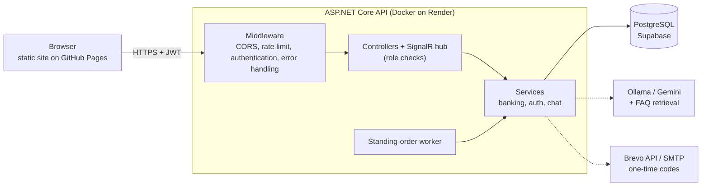

# ❖ SmartBank - Premium Fintech & Digital Banking Portal

[](https://github.com/Alonessam/SmartBank-/actions/workflows/ci.yml)

SmartBank is a **portfolio project**: a digital-banking web app built on **.NET 10 (ASP.NET Core Web API)** with a vanilla HTML/CSS/JS frontend. It covers multi-currency accounts, market rates, credit cards with statements, standing orders, rule-based fraud checks and an AI-assisted support chat with live agents.

> **Everything is simulated.** The money, the cards and the exchange rates are fake. It is not a real bank and it is not a regulated or PCI-certified product.

*(Türkçe açıklama için sayfanın altına kaydırabilirsiniz / Scroll down for the Turkish version)*

## ✅ What v1.1 changed

Version 1.1 is a security and reliability pass, driven by a review of the original code. The headline fixes: any customer could read other customers' chats and write into them as a bank agent, a password could be reset with just a T.C. number, the 2FA code was returned in the response, concurrent transfers could create money (reproduced on SQL Server and PostgreSQL, then fixed), and the JWT and AES keys were committed to the repository. Each fix has tests, several were proven by making the test fail first. The full story, with the reasoning and the trade-offs, is in [`docs/DEFENSE.md`](docs/DEFENSE.md); the list is in [`CHANGELOG.md`](CHANGELOG.md).

---

## 🚀 Key Features & Capabilities

### 1. Multi-Currency Asset & Wealth Management
* **Diverse Wallets:** Manage fiat accounts (**TRY, USD, EUR**) alongside precious metals (**Gold - XAU, Silver - XAG**).
* **Smart Account Deletion (with Balance Transfer):** Closing an account with an active balance prompts the user to select a destination account. The system automatically converts the remaining funds based on live market rates and closes the account seamlessly.
* **No-Zero Policy:** Ensures active users always keep at least one default account.

### 2. Live Forex & Metals Trading (Buy/Sell)
* **Dynamic Calculations:** The exchange rate and final cost/yield update dynamically in real time as the user types the purchase or sale amount.
* **Automatic Wallet Opening:** Purchasing a foreign currency or metal automatically spawns the corresponding asset wallet for the user if it doesn't already exist.

### 3. Credit Card Workspace
* **Single-Card Rule:** Users are restricted to having a maximum of one credit card.
* **Visual Card Customizer:** Interactive card interface featuring a custom neon glow theme selection (Default, Midnight Black, Emerald Green, Neon Blue). Cardholder name auto-scaling prevents layout overflow.
* **Debt & Statement Operations:** Real-time billing cycle statements, minimum payment tracking, and automated debt payment via selected accounts.
* **Automatic Standing Orders:** Automatically schedules automatic bill payments or card debt settlement.

### 4. Saved Contacts & Quick Transfers
* **Saved Contacts Directory:** Add new recipients by account number (IBAN), manage aliases, edit contact names, or delete them.
* **Quick Fill:** Select a saved contact from a dropdown list to instantly populate transfer details.

### 5. AI Support Chatbot & Agent Co-Pilot (SignalR)
* **Hybrid Support System:** Real-time chat powered by **SignalR**. The chat is handled by a Local AI bot (via **RAG & Ollama/Gemini**) and can be escalated to a live human support agent.
* **Agent Workspace:** Dedicated dashboard for support agents showing live chat queues, average response times, resolution metrics, and status toggles.
* **AI Co-Pilot Recommendations:** The AI automatically scans user messages and suggests quick action scripts or template responses to the live agent.

---

## 🏛️ Architecture & Design Patterns



Layers: `SmartBank.Core` (entities, DTOs, interfaces and the pure security rules for one-time codes and lockout), `SmartBank.Infrastructure` (EF Core, services, background worker), `SmartBank.API` (controllers, SignalR hub, middleware), `SmartBank.Web` (static frontend) and `SmartBank.Tests`.

### 1. Caching Pattern (Decorator & Memory Cache)
* **Design:** Implemented using the **Decorator Pattern**. The HTTP-based `MarketRateService` is wrapped inside `CachedMarketRateService` without altering existing client code (Open-Closed Principle).
* **Behavior:** Serbest piyasa rates are cached in the application's memory (`IMemoryCache`) for **5 minutes**, drastically reducing external network latency and protecting the system against third-party API rate limits or IP bans.

### 2. Hosted Background Services (Worker / Cron Job)
* **Design:** Built using .NET's built-in **`BackgroundService` (IHostedService)**.
* **Behavior:** The `StandingOrderExecutionWorker` wakes every 30 seconds, finds due orders and executes each one in its own scope and database transaction. An order runs exactly once even if several workers or a customer's transfer touch the same rows (see concurrency below). A collision does not deactivate the order, it is retried on the next cycle; only a real failure deactivates it.

### 3. Audit Trail (Audit Logs)
* **Behavior:** Sensitive actions (registration, sign-in, failed sign-in and lockout, password reset, transfers, exchange, account closing) are written to an `AuditLogs` table with a detail text, the caller's real IP address and a timestamp.
* **Honest caveat:** the application only ever inserts audit rows, but the database does not enforce it (no permissions or triggers prevent updates or deletes). It is append-only by convention, **not tamper-proof**.

### 4. Global Exception Middleware (RFC 7807-style Problem Details)
* **Design:** Centralized error handler built as an ASP.NET Core middleware.
* **Behavior:** Unhandled exceptions are caught at the pipeline root and returned as problem-details JSON (`type`, `title`, `status`, `detail`, `instance`) plus a `traceId`. Outside Development the `detail` is generic and the real exception goes to the log, so internals (SQL text, stack traces) never reach a client.

### 5. Validation Pipeline (FluentValidation)
* **Design:** Separates model validation rules from business logic.
* **Behavior:** `RegisterDtoValidator` and `TransferRequestDtoValidator` perform strict validations (TCKN 11-digit checks, 6-digit PIN checks, positive amount checks) in the API request lifecycle.

### 6. Concurrency-safe Money Movement (Optimistic Concurrency)
* **Problem it solves:** two requests that read the same balance and each write their own result (a "lost update"). On a real database this created money out of thin air before v1.1.
* **Design:** `Account` and `CreditCard` carry an integer `Version`; every update is `WHERE Id = @id AND Version = @read`. If the row changed in between, nothing is written and the operation is repeated from fresh reads (up to 10 times, with a short random back-off). SQL Server deadlock victims and PostgreSQL serialization failures are retried the same way. A plain integer behaves the same on both databases, unlike `rowversion` or `xmin`.

### 7. Automated Tests (xUnit, Moq, WebApplicationFactory, SignalR client)
* **Unit tests:** pure rules (one-time codes, lockout, encryption, CORS policy, error middleware) and services against EF Core's in-memory provider.
* **Real-database tests:** concurrent transfers, deposits and card charges, the standing-order worker and the PostgreSQL upgrade script run against SQL Server and/or PostgreSQL (the in-memory provider cannot reproduce races). CI runs them against PostgreSQL.
* **Integration tests:** the whole application is started in memory and driven over HTTP and SignalR: roles, chat endpoints, the hub, and cross-customer access to accounts and cards (IDOR). Several were first run against the vulnerable code to prove they fail.
* **Hygiene guards:** a test fails if any source file contains double-encoded Turkish text, and CI fails on skipped tests, vulnerable NuGet packages and `System.Random` in security code.

---

## 🛠️ Technology Stack

* **Backend:** .NET 10 (C#), EF Core, SignalR, BCrypt.NET, FluentValidation. **PostgreSQL in production, SQL Server LocalDB for local development**
* **Frontend:** Semantic HTML5, Vanilla CSS3 (Custom Variables, Keyframes, Glassmorphism), ES6+ JavaScript, Chart.js
* **AI:** Ollama (Llama 3/Local LLM) and Gemini API with FAQ retrieval (RAG)
* **Testing:** xUnit, Moq, EF Core InMemory, `Microsoft.AspNetCore.Mvc.Testing`, SignalR client; SQL Server and PostgreSQL for the real-database tests
* **Delivery:** Docker, GitHub Actions (build, tests with a PostgreSQL service, dependency audit), Dependabot

---

## 🌐 Live Demo & Deployment

The application is fully deployed and accessible on the cloud:
* **Frontend Web App (GitHub Pages):** [https://alonessam.github.io/SmartBank-/](https://alonessam.github.io/SmartBank-/)
* **Backend REST API (Render Docker):** `https://smartbank-fintech-api.onrender.com`
* **Database (Supabase PostgreSQL):** Configured via Session Connection Pooler.

Things to know about the demo: the API runs on a free tier, so the **first request after a quiet period takes about a minute** while the service wakes up (the market-rates box shows "Yükleniyor..." until then). One-time codes are e-mailed, so password reset only works where SMTP is configured; the public demo may run with `Demo__ExposeOtp=true`, which shows 2FA codes in the UI so the flow can be demonstrated without a mailbox (see the settings table below). Do not enter real personal data: it is a demo.

---

## 🔐 Security Model

| Risk | What the code does |
|---|---|
| Secrets in the repository | JWT and encryption keys come from user-secrets or environment variables; the API refuses to start without them (fail fast). |
| Card data | AES-256-GCM with a random nonce per value (tampering is detected). Card duplicates are found through a keyed HMAC. The CVV is **never stored**; it is shown once when a card is issued. |
| Guessing a PIN or a one-time code | 5 wrong PINs lock the account for 15 minutes; a one-time code dies after 5 wrong guesses, expires after 5 minutes, is single-use and bound to its purpose (and, for transfers, to the exact amount and recipient). Per-IP rate limit on the auth endpoints. Unknown T.C. numbers and wrong PINs get identical answers. |
| Account takeover | Password reset needs a code e-mailed to the owner; the 2FA code is not returned by the API (unless the demo flag is on). |
| Who may do what | Roles live in the database and in the token. Customers reach only their own accounts, cards and chats; support-agent endpoints and hub methods need the `Agent` role, which only an administrator can grant. Verified with cross-customer (IDOR) integration tests. |
| Browser access | CORS accepts only the origins listed in configuration. |
| Concurrent requests | Optimistic concurrency with retry on every money movement. |
| Information leaks | Errors return a generic message and a trace id; details go to the log. |

## ⚠️ Known Limitations

Be honest about what this is: a portfolio project with a simulated bank. In particular:

* **The `deposit` endpoint is a demo faucet.** Any signed-in user can add money to their own account (up to 10,000,000 TRY). A real system has nothing like it.
* **Tokens last 7 days and cannot be revoked.** A role change, a lockout or a password reset does not invalidate tokens that were already issued. Tokens are kept in `localStorage`, so a cross-site-scripting bug would expose them. Since v1.2 every value that comes from another user is HTML-escaped before it reaches the page and the pages carry a Content-Security-Policy without inline scripts, but a `<meta>` CSP cannot set `frame-ancestors` and any future XSS bug would still be able to read the token.
* **The rate limiter is per instance.** Behind several instances the limit is not shared (that would need a shared store or a gateway).
* **One-time codes are stored in plain text** in the database for their five-minute life (hashing them is the production choice).
* **Cards are simulated:** numbers carry no check digit, the credit card number is returned in full by the API (the UI masks it), and nothing here is PCI-certified.
* **The audit trail is append-only by convention**, not tamper-proof (see above).
* **Registration reveals whether a username or T.C. number is already taken.**
* **The AI chat** was not reviewed for what it may disclose about a customer or for prompt injection.
* **Two database providers.** The EF migrations target SQL Server; production is PostgreSQL with a hand-run script ([`docs/deploy`](docs/deploy/v1.1-postgres-upgrade.sql), tested against a real PostgreSQL). A single-provider setup would be cleaner.
* The Docker image was changed to run as a non-root user but could not be built on the machine where v1.1 was written; deploy it once and check.

---

## ⚙️ Setup & Configuration

### 1. Database Initialization
Before running the API, verify your connection string in `appsettings.json` (defaults to SQL Server LocalDB) and run migrations. Run `./scripts/dev-secrets.ps1` first (see step 2): the API validates its secrets at startup, and `dotnet ef` starts the API to find the `DbContext`.
```bash
dotnet ef database update --project src/SmartBank.Infrastructure --startup-project src/SmartBank.API
```

> **Upgrading a PostgreSQL deployment to v1.1?** Run [`docs/deploy/v1.1-postgres-upgrade.sql`](docs/deploy/v1.1-postgres-upgrade.sql) once before deploying. Card data is now encrypted with AES-GCM under a new key, so card numbers stored by earlier versions cannot be decrypted. The CVV is no longer stored at all: it is shown once, when a card is issued.

### 2. Configure Secrets
Secrets are **never** stored in `appsettings.json`. The API refuses to start without a JWT signing key and an encryption key.

**Local development** (uses .NET user-secrets, nothing is written to the repository):
```powershell
./scripts/dev-secrets.ps1
```
This generates random values for `JwtSettings:Key` and `Encryption:Key`. To add a Gemini key: `dotnet user-secrets set GeminiSettings:ApiKey <your-key> --project src/SmartBank.API`.

**Production** (e.g. Render): set these environment variables.

| Variable | Description |
|---|---|
| `JwtSettings__Key` | JWT signing key, at least 32 bytes (e.g. 48 random bytes, base64) |
| `Encryption__Key` | AES-256 key, base64 of exactly 32 random bytes |
| `ConnectionStrings__DefaultConnection` | Database connection string |
| `GeminiSettings__ApiKey` | Optional, Gemini API key |
| `Brevo__ApiKey`, `Brevo__SenderEmail`, `Brevo__SenderName` | **Recommended on Render.** E-mails one-time codes through the [Brevo](https://www.brevo.com) HTTPS API (free tier: 300 mails/day). `SenderEmail` must be a sender address verified in Brevo; the API refuses to start if only the key is set. Free hosts block SMTP ports, which is why this goes over HTTPS. A free-mail sender such as `@gmail.com` cannot be signed by Brevo, so some providers may put the mail in spam |
| `SmtpSettings__Host`, `__Port`, `__Username`, `__Password`, `__EnableSsl`, `__FromAddress` | Plain SMTP, used only when `Brevo__ApiKey` is not set (local development, or a host that allows SMTP). With neither Brevo nor `Host`, no e-mail is sent and **password reset cannot be completed** |
| `Demo__ExposeOtp` | `false` by default. If `true`, 2FA/transfer codes are also returned in API responses and written to the log so the demo works without a mailbox. **This removes the value of the second factor. Never enable it where real data lives.** The local `http`/`https` launch profiles enable it |
| `RateLimiting__Auth__PermitLimit`, `__WindowSeconds` | Per-IP limit on `/api/auth/*` (default 10 requests per 60 s) |
| `Cors__AllowedOrigins__0`, `__1`, … | Browser origins allowed to call the API (default `https://alonessam.github.io`). Anything else is rejected. In Development, pages opened from disk and `localhost` are also accepted |

Health endpoints: `GET /health` (liveness, touches nothing) and `GET /health/ready` (readiness, checks the database). Both answer only `Healthy`/`Unhealthy`; point the platform's health check at `/health`.

Behind a reverse proxy (Render, etc.) the container image sets `ASPNETCORE_FORWARDEDHEADERS_ENABLED=true` so the rate limit and the audit log see the real client IP. Do not expose that image directly to the internet.

### 3. Run the Backend API
```bash
dotnet run --project src/SmartBank.API --launch-profile http
```

### 4. Run the Client Portal
Serve `src/SmartBank.Web` from a local web server, for example VS Code's **Live Server** (right-click `index.html`, *Open with Live Server*, usually `http://127.0.0.1:5500`). On Windows, `baslat.bat` in the repository root starts the API (step 3) in one go.

> **Do not open `index.html` straight from disk.** A page opened from a file has no host name, so `app.js` then talks to the live Render API instead of your local one (it only uses `http://localhost:5038` when the page itself is served from `localhost` or `127.0.0.1`).

### 5. Run the Tests

```bash
dotnet test SmartBank.slnx
```

The unit tests need nothing else. A second group of tests runs against a **real database**, because races between concurrent requests cannot be reproduced with the in-memory provider: concurrent transfers, deposits and card charges, the standing-order worker, and the PostgreSQL upgrade script. They are skipped (and reported as skipped) unless you point them at a server through environment variables; each test creates and drops its own throw-away database:

```powershell
$env:SMARTBANK_TEST_SQLSERVER = "Server=(localdb)\mssqllocaldb;Trusted_Connection=True;TrustServerCertificate=True"
$env:SMARTBANK_TEST_POSTGRES  = "Host=localhost;Username=postgres;Password=<password>"
dotnet test SmartBank.slnx
```

CI runs them against a PostgreSQL 16 service container, the production database.

### 6. Create a Support Agent

Support-agent access is a **role** stored on the user (`Role`: 0 = Customer, 1 = Agent) and carried in the JWT. Nothing in the API can grant it: registration always creates a customer, and a username such as `agent_smith` has no special meaning. An administrator promotes an account directly in the database, then the person signs in again to get a token that carries the role:

```sql
UPDATE "Users" SET "Role" = 1 WHERE "Username" = 'agent1';   -- PostgreSQL
UPDATE Users   SET Role   = 1 WHERE Username   = 'agent1';   -- SQL Server
```

---

## 🧪 Testing Credentials (Fresh Database Setup)
Since the database has been fully reset to a clean state, please register a new user using the **Register** tab:
1. Navigate to the login page and click **Register here**.
2. Fill in your T.C. Identity Number (TCKN), Name, Email, and a 6-digit PIN password.
3. Upon registration, you can log in immediately. Your default TRY bank account will be automatically opened.

---
---

# 🇹🇷 SmartBank - Premium Fintech & Dijital Bankacılık Portalı

SmartBank bir **portfolyo projesidir**: **.NET 10 (ASP.NET Core Web API)** ve Vanilla HTML/CSS/JS arayüzüyle geliştirilmiş bir dijital bankacılık web uygulaması. Çoklu para birimli hesaplar, piyasa kurları, ekstreli kredi kartları, otomatik ödeme talimatları, kural tabanlı dolandırıcılık kontrolleri ve canlı temsilcili, yapay zeka destekli bir destek sohbeti içerir.

> **Her şey simülasyondur.** Para, kartlar ve döviz kurları sahtedir. Gerçek bir banka değildir; düzenlemeye tabi veya PCI sertifikalı bir ürün de değildir.

## ✅ v1.1 neleri değiştirdi

Sürüm 1.1, özgün kodun gözden geçirilmesiyle yapılan bir güvenlik ve güvenilirlik turudur. Öne çıkan düzeltmeler: herhangi bir müşteri başkalarının sohbetlerini okuyabiliyor ve onlara banka temsilcisi gibi yazabiliyordu, parola yalnızca T.C. numarasıyla sıfırlanabiliyordu, 2FA kodu yanıtta dönüyordu, eşzamanlı transferler para üretebiliyordu (SQL Server ve PostgreSQL'de yeniden üretildi, sonra düzeltildi), JWT ve AES anahtarları depoya yazılmıştı. Her düzeltmenin testi var; birkaçı önce testin başarısız olduğu gösterilerek kanıtlandı. Gerekçeler ve ödünleşimlerle birlikte tüm hikâye [`docs/DEFENSE.md`](docs/DEFENSE.md) içinde, liste [`CHANGELOG.md`](CHANGELOG.md) içinde.

---

## 🚀 Öne Çıkan Özellikler

### 1. Çoklu Hesap ve Varlık Yönetimi
* **Çeşitlendirilmiş Cüzdanlar:** TRY, USD, EUR vadesiz hesapları ile XAU (Altın) ve XAG (Gümüş) varlık hesaplarının anlık takibi.
* **Bakiye Aktarımlı Hesap Kapatma:** Bir hesabı kapatırken, içerisindeki bakiye canlı kur dönüşümleri ile diğer hesabınıza tek tıkla aktarılır ve hesap silme işlemi güvenli şekilde tamamlanır.
* **Hesap Sınırı:** Aktif kullanıcıların sistemde daima en az bir adet hesabı olması zorunlu kılınmıştır.

### 2. Canlı Döviz & Kıymetli Maden Alım Satımı
* **Dinamik Hesaplama:** Kullanıcı alacağı veya satacağı tutarı yazarken, işlem kuru ve toplam karşılık tutarı sayfa yenilenmeden dinamik olarak hesaplanır.
* **Otomatik Hesap Açma:** Satın alınan döviz veya maden cinsine ait bir cüzdan/hesap kullanıcının hesabında yoksa, sistem bunu otomatik olarak açar.

### 3. Kredi Kartı İşlemleri Paneli
* **Tek Kart Kuralı:** Kullanıcılar güvenlik ve sadelik adına en fazla 1 adet kredi kartına sahip olabilir.
* **Görsel Kart Özelleştirici:** Neon ışıma temalı (Midnight Black, Emerald Green, Neon Blue) interaktif kredi kartı önizlemesi.
* **Borç ve Ekstre Yönetimi:** Faturalandırma dönemi ekstre borcu, asgari ödeme tutarları ve tanımlı hesaplardan borç ödeme sistemi.

### 4. Kayıtlı Alıcılar & Hızlı Transferler
* **Kayıtlı Alıcı Rehberi:** Sık para gönderilen kişileri IBAN ile ekleme, rumuz (alias) düzenleme ve rehberden kaldırma.
* **Hızlı Doldur:** Transfer yaparken kayıtlı kişiyi seçerek tüm bilgilerin formu otomatik doldurmasını sağlama.

### 5. Yapay Zeka Destekli Canlı Destek & SignalR
* **Hibrit Destek Hattı:** **SignalR** tabanlı anlık sohbet. Destek talepleri önce RAG (Retrieval-Augmented Generation) kullanan yerel yapay zeka botu tarafından yanıtlanır, gerektiğinde canlı temsilci paneline aktarılır.
* **Temsilci Çalışma Alanı:** Destek temsilcileri için aktif sohbet kuyrukları, ortalama yanıt süreleri ve AI Co-Pilot öneri widget'ları sunan gelişmiş dashboard.

---

## 🏛️ Mimari ve Tasarım Kalıpları

Katmanlar: `SmartBank.Core` (varlıklar, DTO'lar, arayüzler ve tek kullanımlık kod ile hesap kilidi için saf güvenlik kuralları), `SmartBank.Infrastructure` (EF Core, servisler, arka plan işçisi), `SmartBank.API` (denetleyiciler, SignalR hub'ı, ara katmanlar), `SmartBank.Web` (statik arayüz) ve `SmartBank.Tests`. Akış şeması için İngilizce bölümdeki diyagrama bakın.

### 1. Önbellek Yapısı (Decorator & Memory Cache)
* **Tasarım:** **Decorator Tasarım Kalıbı** kullanılmıştır. `MarketRateService` sınıfı, mevcut istemci kodları değiştirilmeden `CachedMarketRateService` ile sarmalanmıştır (Açık-Kapalı Prensibi).
* **Davranış:** Canlı döviz kurları sunucu belleğinde (`IMemoryCache`) **5 dakika** boyunca saklanır. Bu sayede API yanıt süreleri kısalır ve dış servisin rate-limit engellemelerine takılması önlenir.

### 2. Arka Plan Servisleri (Hosted Services / Worker)
* **Tasarım:** .NET yerleşik **`BackgroundService` (IHostedService)** altyapısı kullanılmıştır.
* **Davranış:** `StandingOrderExecutionWorker` her 30 saniyede bir uyanır, vadesi gelen talimatları bulur ve her birini kendi kapsamında ve kendi veritabanı transaction'ında çalıştırır. Birden fazla işçi veya bir müşteri transferi aynı satırlara dokunsa bile talimat tam olarak bir kez çalışır (aşağıdaki eşzamanlılık bölümüne bakın). Çakışma talimatı kapatmaz, sonraki döngüde yeniden denenir; yalnızca gerçek bir hata talimatı kapatır.

### 3. Denetim Günlüğü (Audit Trail)
* **Davranış:** Hassas işlemler (kayıt, giriş, başarısız giriş ve kilitlenme, şifre sıfırlama, transfer, döviz, hesap kapatma) detay metni, çağıranın gerçek IP adresi ve zaman damgasıyla `AuditLogs` tablosuna yazılır.
* **Dürüst not:** Uygulama denetim satırlarını yalnızca ekler, ancak veritabanı bunu zorlamaz (güncelleme/silmeyi engelleyen yetki veya tetikleyici yok). Gelenek gereği yalnızca-ekleme'dir, **kurcalamaya karşı korumalı değildir**.

### 4. Global Hata Yakalama (RFC 7807 tarzı Problem Details)
* **Tasarım:** Hata yönetimini merkezileştiren ASP.NET Core middleware yapısı.
* **Davranış:** Beklenmeyen hatalar boru hattının kökünde yakalanır ve `traceId` ile birlikte problem-details JSON'u olarak dönülür. Geliştirme dışında `detail` geneldir ve gerçek istisna loga gider; böylece iç ayrıntılar (SQL metni, stack trace) istemciye ulaşmaz.

### 5. Validasyon Pipeline'ı (FluentValidation)
* **Tasarım:** Model doğrulama kurallarını iş mantığından ayırır.
* **Davranış:** `RegisterDtoValidator` ve `TransferRequestDtoValidator` sınıfları TCKN, 6 haneli PIN şifresi ve transfer tutarlarını API istek hattı üzerinde sıkı doğrulamalara tabi tutar.

### 6. Eşzamanlılığa Dayanıklı Para Hareketleri (İyimser Eşzamanlılık)
* **Çözdüğü sorun:** aynı bakiyeyi okuyup her biri kendi sonucunu yazan iki istek ("kayıp güncelleme"). v1.1'den önce gerçek bir veritabanında bu, yoktan para üretiyordu.
* **Tasarım:** `Account` ve `CreditCard` tamsayı bir `Version` taşır; her güncelleme `WHERE Id = @id AND Version = @okunan` ile yapılır. Satır arada değiştiyse hiçbir şey yazılmaz ve işlem taze okumalarla yeniden yapılır (en fazla 10 kez, kısa rastgele bekleme ile). SQL Server deadlock kurbanları ve PostgreSQL serileştirme hataları da aynı yolla yeniden denenir. Düz bir tamsayı, `rowversion` veya `xmin`'in aksine iki veritabanında da aynı davranır.

### 7. Otomasyonlu Testler (xUnit, Moq, WebApplicationFactory, SignalR istemcisi)
* **Birim testler:** saf kurallar (tek kullanımlık kodlar, kilit, şifreleme, CORS politikası, hata ara katmanı) ve EF Core InMemory'ye karşı servisler.
* **Gerçek veritabanı testleri:** eşzamanlı transfer, yatırma ve kart harcaması, talimat işçisi ve PostgreSQL yükseltme betiği SQL Server ve/veya PostgreSQL'e karşı çalışır (InMemory yarışları yeniden üretemez). CI bunları PostgreSQL'e karşı çalıştırır.
* **Entegrasyon testleri:** uygulamanın tamamı bellekte başlatılıp HTTP ve SignalR üzerinden sürülür: roller, sohbet uçları, hub, hesaplara ve kartlara müşteriler arası erişim (IDOR). Birçoğu önce savunmasız koda karşı çalıştırılıp başarısız olduğu kanıtlandı.
* **Hijyen korumaları:** bir kaynak dosyada çift kodlanmış Türkçe metin varsa test düşer; CI atlanan testlerde, açıklı NuGet paketlerinde ve güvenlik kodunda `System.Random`'da başarısız olur.

---

## 🛠️ Kullanılan Teknolojiler

* **Backend:** .NET 10 (C#), EF Core, SignalR, BCrypt.NET, FluentValidation. **Üretimde PostgreSQL, yerel geliştirmede SQL Server LocalDB**
* **Frontend:** HTML5, Vanilla CSS3 (Neon Glow & Glassmorphism), Javascript (ES6+), Chart.js
* **Yapay Zeka:** Ollama (Llama 3/Yerel LLM) ve Gemini API ile SSS getirimi (RAG)
* **Test:** xUnit, Moq, EF Core InMemory, `Microsoft.AspNetCore.Mvc.Testing`, SignalR istemcisi; gerçek veritabanı testleri için SQL Server ve PostgreSQL
* **Teslimat:** Docker, GitHub Actions (derleme, PostgreSQL servisli testler, bağımlılık denetimi), Dependabot

---

## 🌐 Canlı Demo & Dağıtım

Uygulama bulut altyapısı üzerinde canlıya alınmıştır ve test edilebilir durumdadır:
* **Canlı Arayüz (GitHub Pages):** [https://alonessam.github.io/SmartBank-/](https://alonessam.github.io/SmartBank-/)
* **Canlı API Sunucusu (Render Docker):** `https://smartbank-fintech-api.onrender.com`
* **Veritabanı (Supabase PostgreSQL):** Session Connection Pooler üzerinden yapılandırılmıştır.

Demo hakkında bilmeniz gerekenler: API ücretsiz katmanda çalışıyor, bu yüzden **sessiz bir dönemden sonraki ilk istek yaklaşık bir dakika sürer** (servis uyanırken piyasa kutusunda "Yükleniyor..." görünür). Tek kullanımlık kodlar e-postayla gönderilir, bu yüzden şifre sıfırlama yalnızca SMTP yapılandırılmış yerlerde çalışır; herkese açık demo, kodları arayüzde göstererek akışı e-posta kutusu olmadan sergilemek için `Demo__ExposeOtp=true` ile çalışıyor olabilir (aşağıdaki ayar tablosuna bakın). Gerçek kişisel veri girmeyin: bu bir demodur.

---

## 🔐 Güvenlik Modeli

| Risk | Kodun yaptığı |
|---|---|
| Depodaki gizli bilgiler | JWT ve şifreleme anahtarları user-secrets veya ortam değişkenlerinden gelir; anahtar yoksa API başlamaz (fail fast). |
| Kart verisi | Her değer için rastgele nonce ile AES-256-GCM (kurcalama tespit edilir). Kart tekrarları anahtarlı HMAC ile bulunur. CVV **hiç saklanmaz**; kart oluşturulurken bir kez gösterilir. |
| PIN veya tek kullanımlık kodu tahmin etme | 5 yanlış PIN hesabı 15 dakika kilitler; tek kullanımlık kod 5 yanlış tahminde yok edilir, 5 dakikada sona erer, tek kullanımlıktır ve amacına (transferde tam tutara ve alıcıya) bağlıdır. Auth uçlarında IP başına hız sınırı. Bilinmeyen T.C. numarası ve yanlış PIN aynı yanıtı alır. |
| Hesap ele geçirme | Şifre sıfırlama, sahibine e-postayla gönderilen kodu ister; 2FA kodu API'den dönmez (demo bayrağı açık değilse). |
| Kim neyi yapabilir | Roller veritabanında ve token'da yaşar. Müşteriler yalnızca kendi hesaplarına, kartlarına ve sohbetlerine ulaşır; temsilci uçları ve hub metotları yalnızca yöneticinin verebileceği `Agent` rolünü ister. Müşteriler arası (IDOR) entegrasyon testleriyle doğrulandı. |
| Tarayıcı erişimi | CORS yalnızca yapılandırmada listelenen origin'leri kabul eder. |
| Eşzamanlı istekler | Her para hareketinde yeniden denemeli iyimser eşzamanlılık. |
| Bilgi sızıntıları | Hatalar genel mesaj ve izleme kimliği döner; ayrıntılar loga gider. |

## ⚠️ Bilinen Sınırlamalar

Bunun ne olduğu konusunda dürüst olalım: simüle edilmiş bir bankaya sahip bir portfolyo projesi. Özellikle:

* **`deposit` ucu bir demo musluğudur.** Giriş yapan herkes kendi hesabına para ekleyebilir (10.000.000 TL'ye kadar). Gerçek bir sistemde buna benzer bir şey olmaz.
* **Token'lar 7 gün geçerlidir ve iptal edilemez.** Rol değişikliği, kilitlenme veya şifre sıfırlama zaten verilmiş token'ları geçersiz kılmaz. Token'lar `localStorage`'da tutulur, bu yüzden bir siteler arası betik (XSS) hatası bunları açığa çıkarır. v1.2'den beri başka bir kullanıcıdan gelen her değer sayfaya girmeden önce HTML'e kaçırılıyor ve sayfalar satır içi betiğe izin vermeyen bir Content-Security-Policy taşıyor; ancak `<meta>` ile verilen CSP `frame-ancestors` ayarlayamaz ve ileride çıkacak bir XSS hatası yine token'ı okuyabilir.
* **Hız sınırlayıcı örnek başınadır.** Birden fazla örnek arkasında sınır paylaşılmaz (bunun için ortak bir depo veya ağ geçidi gerekir).
* **Tek kullanımlık kodlar** beş dakikalık ömürleri boyunca veritabanında düz metin saklanır (üretimde özetlenmesi tercih edilir).
* **Kartlar simülasyondur:** numaralarda kontrol basamağı yok, kredi kartı numarası API'den tam döner (arayüz maskeler), hiçbir şey PCI sertifikalı değildir.
* **Denetim günlüğü gelenek gereği yalnızca-ekleme'dir**, kurcalamaya karşı korumalı değildir (yukarıya bakın).
* **Kayıt, kullanıcı adının veya T.C. numarasının alınmış olduğunu belli eder.**
* **Yapay zeka sohbeti**, bir müşteri hakkında neyi ifşa edebileceği ve istem enjeksiyonu açısından gözden geçirilmedi.
* **İki veritabanı sağlayıcısı.** EF migration'ları SQL Server'ı hedefler; üretim, elle çalıştırılan bir betikle PostgreSQL'dir ([`docs/deploy`](docs/deploy/v1.1-postgres-upgrade.sql), gerçek bir PostgreSQL'e karşı test edildi). Tek sağlayıcılı bir kurulum daha temiz olurdu.
* Docker imajı root olmayan kullanıcıyla çalışacak şekilde değiştirildi ama v1.1'in yazıldığı makinede derlenemedi; bir kez dağıtıp kontrol edin.

---

## ⚙️ Kurulum ve Çalıştırma

### 1. Veritabanı Migrasyonları & Seed Verileri
API sunucusunu çalıştırmadan önce `appsettings.json` içindeki bağlantı dizesini kontrol edin ve migrasyonları uygulayın. Önce `./scripts/dev-secrets.ps1` çalıştırın (2. adıma bakın): API gizli anahtarlarını açılışta doğrular ve `dotnet ef`, `DbContext`'i bulmak için API'yi başlatır.
```bash
dotnet ef database update --project src/SmartBank.Infrastructure --startup-project src/SmartBank.API
```

> **PostgreSQL ortamını v1.1'e mi yükseltiyorsunuz?** Yayına almadan önce [`docs/deploy/v1.1-postgres-upgrade.sql`](docs/deploy/v1.1-postgres-upgrade.sql) betiğini bir kez çalıştırın. Kart verisi artık yeni bir anahtarla AES-GCM ile şifreleniyor, bu yüzden önceki sürümlerde saklanan kart numaraları çözülemez. CVV artık hiç saklanmıyor: kart oluşturulurken yalnızca bir kez gösteriliyor.

### 2. Gizli Anahtarları Yapılandırın
Gizli anahtarlar `appsettings.json` içinde **tutulmaz**. JWT imza anahtarı ve şifreleme anahtarı olmadan API başlamaz.

**Yerel geliştirme** (.NET user-secrets kullanır, depoya hiçbir şey yazılmaz):
```powershell
./scripts/dev-secrets.ps1
```
Bu betik `JwtSettings:Key` ve `Encryption:Key` için rastgele değerler üretir. Gemini anahtarı için: `dotnet user-secrets set GeminiSettings:ApiKey <anahtar> --project src/SmartBank.API`.

**Üretim** (örn. Render): şu ortam değişkenlerini tanımlayın.

| Değişken | Açıklama |
|---|---|
| `JwtSettings__Key` | JWT imza anahtarı, en az 32 bayt (örn. 48 rastgele bayt, base64) |
| `Encryption__Key` | AES-256 anahtarı, tam 32 rastgele baytın base64 hâli |
| `ConnectionStrings__DefaultConnection` | Veritabanı bağlantı dizesi |
| `GeminiSettings__ApiKey` | İsteğe bağlı, Gemini API anahtarı |
| `Brevo__ApiKey`, `Brevo__SenderEmail`, `Brevo__SenderName` | **Render için önerilen.** Tek kullanımlık kodları [Brevo](https://www.brevo.com) HTTPS API'si üzerinden e-postayla gönderir (ücretsiz katman: günde 300 e-posta). `SenderEmail`, Brevo'da doğrulanmış bir gönderen adresi olmalıdır; yalnızca anahtar verilirse API başlamayı reddeder. Ücretsiz barındırıcılar SMTP portlarını engeller, bu yüzden HTTPS kullanılır. `@gmail.com` gibi bir gönderen adresini Brevo imzalayamaz, bu yüzden bazı sağlayıcılar postayı spama atabilir |
| `SmtpSettings__Host`, `__Port`, `__Username`, `__Password`, `__EnableSsl`, `__FromAddress` | Düz SMTP; yalnızca `Brevo__ApiKey` verilmemişse kullanılır (yerel geliştirme veya SMTP'ye izin veren bir sunucu). Brevo da `Host` da yoksa e-posta gönderilmez ve **parola sıfırlama tamamlanamaz** |
| `Demo__ExposeOtp` | Varsayılan `false`. `true` ise 2FA/transfer kodları API yanıtında da döner ve loga yazılır, böylece demo e-posta kutusu olmadan çalışır. **İkinci faktörün değerini ortadan kaldırır. Gerçek verinin bulunduğu hiçbir yerde açmayın.** Yerel `http`/`https` başlatma profilleri bunu açar |
| `RateLimiting__Auth__PermitLimit`, `__WindowSeconds` | `/api/auth/*` için IP başına sınır (varsayılan 60 sn'de 10 istek) |
| `Cors__AllowedOrigins__0`, `__1`, … | API'yi çağırabilecek tarayıcı origin'leri (varsayılan `https://alonessam.github.io`). Başka her şey reddedilir. Geliştirme modunda diskten açılan sayfalar ve `localhost` da kabul edilir |

Sağlık uçları: `GET /health` (canlılık, hiçbir şeye dokunmaz) ve `GET /health/ready` (hazırlık, veritabanını kontrol eder). İkisi de yalnızca `Healthy`/`Unhealthy` döndürür; platformun sağlık kontrolünü `/health`'e yönlendirin.

Ters vekil (Render vb.) arkasında kapsayıcı imajı `ASPNETCORE_FORWARDEDHEADERS_ENABLED=true` ayarlar, böylece hız sınırı ve denetim kaydı gerçek istemci IP'sini görür. Bu imajı doğrudan internete açmayın.

### 3. API Sunucusunu Başlatın
```bash
dotnet run --project src/SmartBank.API --launch-profile http
```
API sunucusu `http://localhost:5038` portunda çalışacaktır.

### 4. Arayüzü Açın
`src/SmartBank.Web` klasörünü yerel bir web sunucusundan sunun, örneğin VS Code **Live Server** ile (`index.html`'e sağ tık, *Open with Live Server*, genelde `http://127.0.0.1:5500`). Windows'ta depo kökündeki `baslat.bat` API'yi (3. adım) tek seferde başlatır.

> **`index.html`'i doğrudan diskten açmayın.** Dosyadan açılan sayfanın host adı olmadığı için `app.js` yerel API'niz yerine canlı Render API'sine bağlanır (`http://localhost:5038` adresini yalnızca sayfanın kendisi `localhost` veya `127.0.0.1` üzerinden sunulurken kullanır).

### 5. Testleri Çalıştırın

```bash
dotnet test SmartBank.slnx
```

Birim testler başka bir şey gerektirmez. İkinci grup testler **gerçek bir veritabanına** karşı çalışır, çünkü eşzamanlı istekler arasındaki yarış durumları InMemory sağlayıcıyla yeniden üretilemez: eşzamanlı transfer/yatırma/kart harcaması, talimat işçisi ve PostgreSQL yükseltme betiği. Ortam değişkeniyle bir sunucu göstermezseniz bu testler atlanır (ve "atlandı" diye raporlanır); her test kendi geçici veritabanını oluşturup siler:

```powershell
$env:SMARTBANK_TEST_SQLSERVER = "Server=(localdb)\mssqllocaldb;Trusted_Connection=True;TrustServerCertificate=True"
$env:SMARTBANK_TEST_POSTGRES  = "Host=localhost;Username=postgres;Password=<parola>"
dotnet test SmartBank.slnx
```

CI bu testleri üretim veritabanı olan PostgreSQL 16 servis kapsayıcısına karşı çalıştırır.

### 6. Destek Temsilcisi Oluşturun

Destek temsilcisi erişimi, kullanıcı üzerinde saklanan ve JWT içinde taşınan bir **roldür** (`Role`: 0 = Müşteri, 1 = Temsilci). API içinden bu rol verilemez: kayıt her zaman müşteri oluşturur ve `agent_smith` gibi bir kullanıcı adının özel bir anlamı yoktur. Yönetici bir hesabı doğrudan veritabanında terfi ettirir, ardından kişi yeniden giriş yaparak rolü taşıyan bir token alır:

```sql
UPDATE "Users" SET "Role" = 1 WHERE "Username" = 'agent1';   -- PostgreSQL
UPDATE Users   SET Role   = 1 WHERE Username   = 'agent1';   -- SQL Server
```

---
Developed with premium design aesthetics and enterprise-ready C# practices. © 2026 SmartBank Team.
