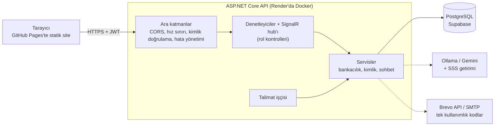

# SmartBank

[](https://github.com/Alonessam/SmartBank-/actions/workflows/ci.yml)
[](https://dotnet.microsoft.com/)
[](LICENSE)

[English](README.md) | **Türkçe**

Simüle edilmiş bir dijital banka: **ASP.NET Core (.NET 10) Web API** ve Vanilla HTML/CSS/JS arayüzü. Çoklu para birimli hesaplar, piyasa kurları, ekstreli kredi kartları, otomatik ödeme talimatları, kural tabanlı dolandırıcılık kontrolleri ve canlı temsilcili, yapay zeka destekli bir destek sohbeti.

> **Her şey simülasyondur.** Para, kartlar ve döviz kurları sahtedir. Gerçek bir banka değildir; düzenlemeye tabi veya PCI sertifikalı bir ürün de değildir. Gerçek kişisel veri girmeyin.

**Canlı demo:** <https://alonessam.github.io/SmartBank-/> (arayüz GitHub Pages üzerinde). API ücretsiz katmanda çalışıyor, bu yüzden **sessiz bir dönemden sonraki ilk istek yaklaşık bir dakika sürer**; servis uyanırken beklemeniz gerekir.

## Demoyu deneyin

1. Canlı demoyu açın ve **Kayıt Ol**'u seçin.
2. İstediğiniz bir kullanıcı adı, 6 haneli bir PIN, bir e-posta adresi ve geçerli kontrol basamaklarına sahip uydurma bir T.C. Kimlik No kullanın, örneğin `11111111110` veya `10000000146` (kimseye ait değiller).
3. Giriş yapın. İlk TRY hesabınız sizin için açılır. Bir transfer, döviz alımı, kredi kartı veya destek sohbetini deneyin.

Tek kullanımlık kodlar (2FA, şifre sıfırlama) e-postayla gönderilir. Ekranda yalnızca API `Demo__ExposeOtp=true` ile çalışıyorsa görünürler; herkese açık demo, akışı e-posta kutusu olmadan sergilemek için bunu kullanıyor olabilir. Destek temsilcisi paneli `Agent` rolünü ister; bunu yalnızca bir yönetici verebilir ([Destek temsilcisi oluşturun](#6-destek-temsilcisi-oluşturun) bölümüne bakın).

## Hızlı başlangıç (Windows, SQL Server LocalDB)

Önkoşullar: [.NET 10 SDK](https://dotnet.microsoft.com/download) ve yardımcı betikler için PowerShell (Linux ve macOS için bash karşılığı var, aşağıya bakın).

```powershell
./scripts/dev-secrets.ps1                                   # bir kez: rastgele yerel anahtarlar user-secrets'a yazılır
dotnet tool restore; dotnet ef database update --project src/SmartBank.Infrastructure --startup-project src/SmartBank.API
dotnet run --project src/SmartBank.API --launch-profile http   # API http://localhost:5038 adresinde
```

Sonra `src/SmartBank.Web` klasörünü herhangi bir statik sunucuyla (VS Code *Live Server* ya da `npx serve src/SmartBank.Web -l 5500`) sunup `http://127.0.0.1:5500` adresinden açın. Linux, macOS'ta veya LocalDB olmadan [Kurulum](#1-veritabanı) bölümündeki PostgreSQL yolunu kullanın.

## Yenilikler

* **1.3** (denetim turu): para doğruluğu düzeltmeleri, güvenlik sertleştirmeleri, arayüz düzeltmeleri ve depo, CI ile Docker iyileştirmeleri (CodeQL, CI'da SQL Server ve Docker işleri, temel PostgreSQL şeması, docker-compose, topluluk dosyaları). Ayrıntılar [`CHANGELOG.md`](CHANGELOG.md) içinde.
* **1.2**: saklı XSS düzeltmesi ve Content-Security-Policy, dönen yenileme token'lı 15 dakikalık erişim token'ları, Brevo HTTPS API'siyle e-posta, destek sohbeti sınırları ve sahte transfer kartı koruması, API güvenlik başlıkları, T.C. Kimlik No kontrol basamakları, üretim şeması düzeltmeleri.
* **1.1**: güvenlik ve güvenilirlik turu (rol tabanlı sohbet yetkilendirmesi, depoda gizli anahtar yok, AES-GCM kart verisi, kaba kuvvet koruması, eşzamanlılığa dayanıklı para hareketleri). Her düzeltmenin gerekçesi ve elenen alternatifler [`docs/DEFENSE.md`](docs/DEFENSE.md) içinde (Türkçe, en üstte İngilizce özet).

---

## Özellikler

### 1. Çoklu varlık yönetimi
* **Cüzdanlar:** TRY, USD, EUR vadesiz hesapları ile XAU (Altın) ve XAG (Gümüş) varlık hesapları.
* **Bakiye aktarımlı hesap kapatma:** içinde para olan bir hesabı kapatırken hedef hesap seçilir; kalan bakiye güncel kurlarla çevrilir ve hesap kapatılır.
* **Hesap sınırı:** kullanıcının daima en az bir aktif hesabı vardır.
* **Vadeli hesap kademeleri:** TRY vadeli hesap, kademeli yıllık faiz oranını ve vade tarihini gösterir. Faiz **yalnızca gösterilir**: hiçbir şey bunu bakiyeye işlemez (Bilinen Sınırlamalar'a bakın).

### 2. Döviz ve kıymetli maden alım satımı
* Kullanıcı tutarı yazarken kur ve toplam karşılık güncellenir.
* Satın alınan döviz veya maden cinsinin cüzdanı yoksa otomatik açılır.
* Kurlar, simüle edilmiş yedek fiyatlara sahip üçüncü taraf bir kaynaktan gelir (Bilinen Sınırlamalar'a bakın).

### 3. Kredi kartı işlemleri paneli
* **Tek kart kuralı:** kullanıcı başına en fazla 1 kredi kartı.
* **Görsel kart özelleştirici:** dört tema (Neon Blue, Sunset Orange, Metallic Dark, Glassmorphism); kart sahibi adı sığacak şekilde küçülür.
* **Ekstre ve borç:** dönem ekstreleri, asgari ödeme, seçilen hesaptan borç ödeme.
* **Otomatik ödeme talimatları:** zamanlanmış fatura ödemeleri ve otomatik kart borcu ödemesi.

### 4. Kayıtlı alıcılar ve hızlı transferler
* Sık para gönderilen kişileri hesap numarasıyla (IBAN) kaydetme, rumuz (alias) düzenleme ve silme.
* Kayıtlı kişiyi seçerek transfer formunu doldurma.

### 5. Yapay zeka destekli canlı destek ve temsilci yardımcısı (SignalR)
* **Hibrit destek:** **SignalR** üzerinden anlık sohbet. Önce bir bot (SSS getirimi ve yerelde Ollama ya da Gemini) yanıtlar, gerektiğinde konuşma canlı temsilciye aktarılır.
* **Temsilci çalışma alanı:** canlı sohbet kuyruğu, ortalama yanıt süresi, çözüm metrikleri, müsaitlik düğmesi.
* **Co-Pilot:** yapay zeka temsilciye hızlı yanıt önerileri sunar.

---

## Mimari



Katmanlar: `SmartBank.Core` (varlıklar, DTO'lar, arayüzler ve tek kullanımlık kod ile hesap kilidi için saf güvenlik kuralları), `SmartBank.Infrastructure` (EF Core, servisler, arka plan işçisi), `SmartBank.API` (denetleyiciler, SignalR hub'ı, ara katmanlar), `SmartBank.Web` (statik arayüz) ve `SmartBank.Tests`. Kimlik doğrulama akışı ve dağıtım topolojisi dahil daha fazla ayrıntı [`docs/ARCHITECTURE.md`](docs/ARCHITECTURE.md) içinde (İngilizce).

### Tasarım notları
1. **Önbellek (Decorator + bellek önbelleği).** `CachedMarketRateService`, HTTP tabanlı `MarketRateService`'i çağıranları değiştirmeden sarar (açık-kapalı prensibi). Kurlar `IMemoryCache` içinde **5 dakika** saklanır; gecikme düşer ve üçüncü taraf kaynağın sınırlarına takılmak önlenir.
2. **Arka plan servisi.** `StandingOrderExecutionWorker` (bir `BackgroundService`) her 30 saniyede bir uyanır, vadesi gelen talimatları bulur ve her birini kendi kapsamında ve veritabanı transaction'ında çalıştırır. Birden fazla işçi veya bir müşteri transferi aynı satırlara dokunsa bile talimat tam olarak bir kez çalışır. Çakışma talimatı kapatmaz, sonraki döngüde yeniden denenir; yalnızca gerçek bir hata talimatı kapatır.
3. **Denetim günlüğü.** Hassas işlemler (kayıt, giriş, başarısız giriş ve kilitlenme, şifre sıfırlama, transfer, döviz, hesap kapatma) detay metni, çağıranın gerçek IP adresi ve zaman damgasıyla `AuditLogs` tablosuna yazılır. Uygulama denetim satırlarını yalnızca ekler, ancak veritabanı bunu zorlamaz: gelenek gereği yalnızca-ekleme'dir, **kurcalamaya karşı korumalı değildir**.
4. **Global hata yakalama (RFC 7807 tarzı problem details).** Beklenmeyen hatalar `traceId` ile birlikte problem-details JSON'u olarak dönülür (`type`, `title`, `status`, `detail`, `instance`). Geliştirme dışında `detail` geneldir ve gerçek istisna loga gider.
5. **Doğrulama (FluentValidation).** `RegisterDtoValidator` ve `TransferRequestDtoValidator`, istek kurallarını (T.C. Kimlik No kontrol basamakları, 6 haneli PIN, tutar aralığı) iş mantığından ayrı tutar.
6. **Eşzamanlılığa dayanıklı para hareketleri (iyimser eşzamanlılık).** `Account` ve `CreditCard` tamsayı bir `Version` taşır; her güncelleme `WHERE Id = @id AND Version = @okunan` ile yapılır. Satır arada değiştiyse hiçbir şey yazılmaz ve işlem taze okumalarla yeniden yapılır (en fazla 10 kez, kısa rastgele bekleme ile). SQL Server deadlock kurbanları ve PostgreSQL serileştirme hataları da aynı yolla yeniden denenir. Düz bir tamsayı, `rowversion` veya `xmin`'in aksine iki veritabanında da aynı davranır. v1.1'den önce bu yarış yoktan para üretiyordu.
7. **Otomasyonlu testler** (xUnit, Moq, WebApplicationFactory, SignalR istemcisi; birkaç yüz test):
   * *Birim testler:* saf kurallar (tek kullanımlık kodlar, kilit, şifreleme, CORS politikası, hata ara katmanı) ve EF Core InMemory'ye karşı servisler.
   * *Gerçek veritabanı testleri:* eşzamanlı transfer, yatırma ve kart harcaması, talimat işçisi ve PostgreSQL yükseltme betikleri PostgreSQL ve/veya SQL Server'a karşı çalışır (InMemory yarışları yeniden üretemez). CI ikisinde de çalıştırır.
   * *Entegrasyon testleri:* uygulamanın tamamı bellekte başlatılıp HTTP ve SignalR üzerinden sürülür: roller, sohbet uçları, hub, hesaplara ve kartlara müşteriler arası erişim (IDOR).
   * *Korumalar:* bir kaynak dosyada çift kodlanmış Türkçe metin varsa test düşer; CI atlanan testlerde, açıklı NuGet paketlerinde, güvenlik kodunda `System.Random`'da, JavaScript sözdizimi hatasında, migration'sız model değişikliğinde ve derlenmeyen Docker imajında başarısız olur.

---

## Kullanılan teknolojiler

* **Backend:** .NET 10 (C#), EF Core, SignalR, BCrypt.NET, FluentValidation. **Üretimde PostgreSQL, yerel geliştirmede SQL Server LocalDB veya PostgreSQL**
* **Frontend:** anlamsal HTML5, Vanilla CSS3 (özel değişkenler, keyframes, glassmorphism), ES6+ JavaScript, Chart.js
* **Yapay zeka:** Ollama (Llama 3, yerel) ve Gemini API, SSS getirimi (RAG) ile
* **Test:** xUnit, Moq, EF Core InMemory, `Microsoft.AspNetCore.Mvc.Testing`, SignalR istemcisi; gerçek veritabanı testleri için PostgreSQL ve SQL Server
* **Teslimat:** Docker, GitHub Actions (derleme, PostgreSQL ve SQL Server'da testler, bağımlılık denetimi, CodeQL, Docker derlemesi), Dependabot

---

## Dağıtım

* **Arayüz (GitHub Pages):** <https://alonessam.github.io/SmartBank-/>, `scripts/deploy-pages.ps1` (veya `.sh`) ile `gh-pages` dalından yayınlanır.
* **API (Render, Docker):** `https://smartbank-fintech-api.onrender.com`, kökteki `Dockerfile`'dan derlenir. Servisin sağlık kontrolü yolunu `/health` yapın.
* **Veritabanı (Supabase PostgreSQL):** oturum bağlantı havuzu (session pooler) üzerinden.

Kendi kopyanızı yayınlamak için: boş bir PostgreSQL veritabanı oluşturup [`docs/deploy/00-baseline-postgres.sql`](docs/deploy/00-baseline-postgres.sql) betiğini çalıştırın; depodan Docker çalışma zamanıyla bir Render *Web Service* oluşturup ortam değişkenlerini [aşağıdaki tablodan](#2-gizli-anahtarları-yapılandırın) tanımlayın; ardından arayüzü dağıtım betiğiyle yayınlayın. Arayüz sabit kodlanmış bir API adresiyle konuşur (`src/SmartBank.Web/app.js` içindeki `API_URL` ve `chat.js` içindeki hub adresi): bir fork için ikisini de değiştirin ve Pages origin'ini `Cors__AllowedOrigins__0` içine yazın.

### PostgreSQL dağıtımını yükseltme

Üretim tabloları elle oluşturulduğu için uygulama veritabanını **taşımaz** (`MigrateAsync`, Supabase havuzu arkasında kapalıdır). Yükseltme betikleri [`docs/deploy`](docs/deploy) içindedir. **Sırayla, her birini bir kez, ilgili API sürümünü yayınlamadan önce** çalıştırın:

1. [`v1.1-postgres-upgrade.sql`](docs/deploy/v1.1-postgres-upgrade.sql): kart verisi sertleştirmesi (CVV artık saklanmaz; v1.0'ın sakladığı kart numaraları yeni anahtarla çözülemez), kilit ve tek kullanımlık kod sütunları, eşzamanlılık sürümleri, roller.
2. [`v1.2-postgres-upgrade.sql`](docs/deploy/v1.2-postgres-upgrade.sql): `RefreshTokens` tablosu ve şema düzeltmeleri (`ChatSessions.IsActive`, boş olabilen `StandingOrders.Amount`, `timestamptz` sütunları).
3. [`v1.3-postgres-upgrade.sql`](docs/deploy/v1.3-postgres-upgrade.sql): v1.3 değişiklikleri.

[`schema-check.sql`](docs/deploy/schema-check.sql), üretimdeki her sütunu listeler; kodun beklediğiyle karşılaştırabilirsiniz. **Yeni** bir veritabanı bunun yerine temel (baseline) betikle oluşturulur ve yükseltme betiklerine ihtiyaç duymaz. Her sürümün adımları [`CHANGELOG.md`](CHANGELOG.md) içindedir.

---

## Güvenlik modeli

| Risk | Kodun yaptığı |
|---|---|
| Depodaki gizli bilgiler | JWT ve şifreleme anahtarları user-secrets veya ortam değişkenlerinden gelir; anahtar yoksa API başlamaz (fail fast). |
| Kart verisi | Her değer için rastgele nonce ile AES-256-GCM (kurcalama tespit edilir). Kart tekrarları anahtarlı HMAC ile bulunur. CVV **hiç saklanmaz**; kart oluşturulurken bir kez gösterilir. |
| PIN veya tek kullanımlık kodu tahmin etme | 5 yanlış PIN hesabı 15 dakika kilitler; tek kullanımlık kod 5 yanlış tahminde yok edilir, 5 dakikada sona erer, tek kullanımlıktır ve amacına (transferde tam tutara ve alıcıya) bağlıdır. Auth uçlarında IP başına hız sınırı. Bilinmeyen T.C. numarası ve yanlış PIN aynı yanıtı alır; hesap kilitliyken API, yanlış PIN'dekiyle aynı genel `InvalidCredentials` mesajını döndürür, böylece kilidin kendisi belli olmaz. |
| Hesap ele geçirme | Şifre sıfırlama, sahibine e-postayla gönderilen kodu ister; 2FA kodu API'den dönmez (demo bayrağı açık değilse). |
| Kimlik numarasında yazım hatası | Kayıt, T.C. Kimlik Numarası kontrol basamaklarını denetler (sunucu ve form). Bu bir biçim denetimidir, **kimlik doğrulama değildir** (bunun için MERNİS gerekir). |
| API'ye tarayıcı tabanlı saldırılar | Her yanıtta `nosniff`, `X-Frame-Options: DENY`, `default-src 'none'` CSP ve `no-referrer` var; `/api` yanıtları `no-store`; üretimde HTTPS üzerinden HSTS gönderilir. |
| Çalınmış token | Erişim token'ları 15 dakika yaşar. Yenileme token'ı tek kullanımlıktır (her yenilemede değişir, yalnızca özeti saklanır); kullanılmış biri tekrar gelirse oturumun tamamı iptal edilir. Çıkış ve şifre sıfırlama tüm oturumları sonlandırır. Başarısız girişler ve kilitlenme sonlandırmaz: aksi halde bir T.C. numarasını bilen herkes sahibini sürekli çıkışa zorlayabilirdi. |
| Kim neyi yapabilir | Roller veritabanında ve token'da yaşar. Müşteriler yalnızca kendi hesaplarına, kartlarına ve sohbetlerine ulaşır; temsilci uçları ve hub metotları yalnızca yöneticinin verebileceği `Agent` rolünü ister. Müşteriler arası (IDOR) entegrasyon testleriyle doğrulandı. |
| Tarayıcı erişimi | CORS yalnızca yapılandırmada listelenen origin'leri kabul eder. |
| Eşzamanlı istekler | Her para hareketinde yeniden denemeli iyimser eşzamanlılık. |
| Bilgi sızıntıları | Hatalar genel mesaj ve izleme kimliği döner; ayrıntılar loga gider. |

## Bilinen sınırlamalar

SmartBank, simüle edilmiş bir bankaya sahip bir portfolyo projesidir. Özellikle:

* **`deposit` ucu bir demo musluğudur.** Giriş yapan herkes kendi hesabına para ekleyebilir (10.000.000 TL'ye kadar). Gerçek bir sistemde buna benzer bir şey olmaz. `Demo__EnableSimulationEndpoints=false`, demoya özgü diğer yardımcıları (kredi kartı test harcaması ve ekstre dönemi ilerletme) kapatır, musluğu kapatmaz.
* **Erişim token'ları iptal edilemez, yalnızca süresinin dolması beklenir.** 15 dakika geçerlidir ve tek kullanımlık bir yenileme (refresh) token'ıyla yenilenir; yenileme token'ı çıkışta ve şifre sıfırlamada iptal **edilir**. Rol değişikliği (SQL ile elle yapılır) bir sonraki yenilemede etkili olur. İki token da `localStorage`'da tutulur, bu yüzden bir siteler arası betik (XSS) hatası bunları açığa çıkarır. Başka bir kullanıcıdan gelen her değer sayfaya girmeden önce HTML'e kaçırılıyor ve sayfalar satır içi betiğe izin vermeyen bir Content-Security-Policy taşıyor; ancak `<meta>` ile verilen CSP `frame-ancestors` ayarlayamaz ve ileride çıkacak bir XSS hatası yine token'ı okuyabilir.
* **Hız sınırlayıcı örnek başınadır.** Birden fazla örnek arkasında sınır paylaşılmaz (bunun için ortak bir depo veya ağ geçidi gerekir).
* **Tek kullanımlık kodlar** beş dakikalık ömürleri boyunca veritabanında düz metin saklanır (üretimde özetlenmesi tercih edilir).
* **Kartlar simülasyondur:** numaralarda kontrol basamağı yok, kredi kartı numarası API'den tam döner (arayüz maskeler), hiçbir şey PCI sertifikalı değildir.
* **Denetim günlüğü gelenek gereği yalnızca-ekleme'dir**, kurcalamaya karşı korumalı değildir (yukarıya bakın).
* **Kayıt, kullanıcı adının, T.C. numarasının veya e-posta adresinin alınmış olduğunu belli eder.**
* **Piyasa kurları, üçüncü taraf bir kaynaktan alınır ve simüle edilmiş yedek fiyatlar içerir.** `MarketRateService` resmî olmayan herkese açık bir JSON kaynağını okur; kaynağa ulaşılamazsa servis fiyat uydurur (sabit değerler etrafında küçük rastgele sapma) ve bu fiyatlar döviz alım ve satımında kullanılır.
* **Vadeli hesap faizi gösterilir, işlenmez.** Kademeli oran ve vade tarihi gösterilir, ancak hiçbir iş bakiyeye faiz eklemez.
* **Yapay zeka sohbeti:** model yalnızca konuşmayı ve istenirse oturum sahibinin kendi bakiyelerini görür; yalnızca müşterinin onaylaması gereken bir transfer *önerebilir* (transferin kendisi normal sahiplik, limit ve tek kullanımlık kod denetimlerinden geçer). Kalanlar: metin ve bu bakiyeler harici bir model sağlayıcısına gönderilir (yerel Ollama kapalıysa Gemini) ve kullanıcı kendi sohbetinde modeli garip cevaplar vermeye ikna edebilir (istem enjeksiyonu); bu yüzden modelin yazdığı hiçbir şey komut olarak güvenilmez.
* **İki veritabanı sağlayıcısı.** EF migration'ları SQL Server'ı hedefler; üretim PostgreSQL'dir, üretilmiş bir temel betikle oluşturulur ve elle çalıştırılan betiklerle yükseltilir (gerçek bir PostgreSQL'e karşı test edildi). Tek sağlayıcılı bir kurulum daha temiz olurdu.

---

## Kurulum ve yapılandırma

### Önkoşullar

* [.NET 10 SDK](https://dotnet.microsoft.com/download) (`global.json` SDK bandını sabitler).
* `dotnet tool restore`, `dotnet-ef` aracını `.config/dotnet-tools.json` dosyasından kurar; genel kurulum gerekmez.
* PowerShell isteğe bağlıdır: `scripts/dev-secrets.sh` ve `scripts/deploy-pages.sh` aynı işi Linux ve macOS'ta yapar.
* Docker isteğe bağlıdır: `docker-compose.yml` yerel bir PostgreSQL'i (isteğe bağlı olarak API'yi de) başlatır.
* Node.js isteğe bağlıdır (yalnızca arayüz betiklerinin sözdizimini denetlemek veya `npx serve` için).

### 1. Veritabanı

API gizli anahtarlarını açılışta doğrular ve `dotnet ef`, `DbContext`'i bulmak için API'yi başlatır; bu yüzden önce `./scripts/dev-secrets.ps1` çalıştırın (2. adım).

**SQL Server LocalDB (Windows).** `appsettings.json` varsayılan olarak LocalDB kullanır:
```bash
dotnet tool restore
dotnet ef database update --project src/SmartBank.Infrastructure --startup-project src/SmartBank.API
```

**PostgreSQL (her işletim sistemi).** Sağlayıcıyı bağlantı dizesi belirler: `Host=` içeren bir dize PostgreSQL'i seçer.
```bash
docker compose up -d db
docker compose exec -T db psql -U postgres -d smartbank < docs/deploy/00-baseline-postgres.sql
```
```powershell
$env:ConnectionStrings__DefaultConnection = "Host=localhost;Port=5432;Database=smartbank;Username=postgres;Password=postgres"
```
(bash'te `export ConnectionStrings__DefaultConnection=...`.) `<` yönlendirmesi olmayan PowerShell'de temel betiği şöyle yükleyin: `Get-Content docs/deploy/00-baseline-postgres.sql | docker compose exec -T db psql -U postgres -d smartbank`. Temel betik EF modelinden üretilir ve yeni bir veritabanı oluşturur; yeniden üretme yolu betiğin başlığındadır. Mevcut bir üretim veritabanı için [Dağıtım](#postgresql-dağıtımını-yükseltme) bölümündeki yükseltme betiklerini kullanın.

### 2. Gizli anahtarları yapılandırın
Gizli anahtarlar `appsettings.json` içinde **tutulmaz**. JWT imza anahtarı ve şifreleme anahtarı olmadan API başlamaz.

**Yerel geliştirme** (.NET user-secrets kullanır, depoya hiçbir şey yazılmaz):
```powershell
./scripts/dev-secrets.ps1        # Linux/macOS: ./scripts/dev-secrets.sh
```
Bu betik `JwtSettings:Key` ve `Encryption:Key` için rastgele değerler üretir (`-Rotate` / `--rotate` mevcut değerleri değiştirir). Gemini anahtarı için: `dotnet user-secrets set GeminiSettings:ApiKey <anahtar> --project src/SmartBank.API`.

**Üretim** (örn. Render): ortam değişkenlerini tanımlayın. İç içe ayarlar çift alt çizgi kullanır (`Bolum__Anahtar`).

| Değişken | Açıklama |
|---|---|
| `JwtSettings__Key` | JWT imza anahtarı, en az 32 bayt (örn. 48 rastgele bayt, base64). **Zorunlu** |
| `JwtSettings__Issuer`, `JwtSettings__Audience` | İsteğe bağlı. Token düzenleyicisi ve hedef kitlesi (varsayılanlar `SmartBankAPI` ve `SmartBankApp`) |
| `JwtSettings__AccessTokenMinutes`, `JwtSettings__RefreshTokenDays` | İsteğe bağlı. Erişim token'ı ömrü (varsayılan 15, 1-1440) ve yenileme token'ı ömrü (varsayılan 7, 1-90). Aralık dışı değerler API'nin başlamasını engeller |
| `Encryption__Key` | AES-256 anahtarı, tam 32 rastgele baytın base64 hâli. **Zorunlu** |
| `ConnectionStrings__DefaultConnection` | Veritabanı bağlantı dizesi (`Host=...` PostgreSQL'i seçer, aksi halde SQL Server) |
| `GeminiSettings__ApiKey`, `GeminiSettings__Model` | İsteğe bağlı. Gemini API anahtarı; model adı (varsayılan `gemini-2.5-flash`) |
| `OllamaSettings__BaseUrl`, `OllamaSettings__Model` | İsteğe bağlı. Yerel Ollama sunucusu (varsayılanlar `http://localhost:11434` ve `llama3`). Render'da yoktur; sohbet o zaman Gemini kullanır |
| `Brevo__ApiKey`, `Brevo__SenderEmail`, `Brevo__SenderName` | **Render için önerilen.** Tek kullanımlık kodları [Brevo](https://www.brevo.com) HTTPS API'si üzerinden e-postayla gönderir (ücretsiz katman: günde 300 e-posta). `SenderEmail`, Brevo'da doğrulanmış bir gönderen adresi olmalıdır; yalnızca anahtar verilirse API başlamayı reddeder. `SenderName` varsayılanı "SmartBank Güvenlik"tir. Ücretsiz barındırıcılar SMTP portlarını engeller, bu yüzden HTTPS kullanılır. `@gmail.com` gibi bir gönderen adresini Brevo imzalayamaz, bu yüzden bazı sağlayıcılar postayı spama atabilir |
| `SmtpSettings__Host`, `__Port`, `__Username`, `__Password`, `__EnableSsl`, `__FromAddress` | Düz SMTP; yalnızca `Brevo__ApiKey` verilmemişse kullanılır (yerel geliştirme veya SMTP'ye izin veren bir sunucu). Brevo da `Host` da yoksa e-posta gönderilmez ve **parola sıfırlama tamamlanamaz** |
| `Demo__ExposeOtp` | Varsayılan `false`. `true` ise 2FA/transfer kodları API yanıtında da döner ve loga yazılır, böylece demo e-posta kutusu olmadan çalışır. **İkinci faktörün değerini ortadan kaldırır. Gerçek verinin bulunduğu hiçbir yerde açmayın.** Yerel `http`/`https` başlatma profilleri bunu açar |
| `Demo__EnableSimulationEndpoints` | Varsayılan `true`. `false` yapılırsa demoya özgü simülasyon uçları (kredi kartı test harcaması ve ekstre dönemi ilerletme; para yatırma musluğu açık kalır) kapanır |
| `RateLimiting__Auth__PermitLimit`, `__WindowSeconds` | `/api/auth/*` için IP başına sınır (varsayılan 60 sn'de 10 istek) |
| `RateLimiting__Refresh__PermitLimit` | Token yenileme ve çıkış için IP başına sınır (varsayılan dakikada 60) |
| `RateLimiting__Banking__PermitLimit` | Bankacılık uçları için kullanıcı başına sınır (kullanıcı belli değilse IP başına; varsayılan dakikada 60) |
| `RateLimiting__Transfer__PermitLimit` | Para hareketi yapan çağrılar (transfer, döviz, para yatırma, kart ödemesi) için kullanıcı başına sınır (varsayılan dakikada 10); bu çağrılarda bankacılık sınırının yerine geçer |
| `RateLimiting__Market__PermitLimit` | Herkese açık piyasa kurları ucu için IP başına sınır (varsayılan dakikada 60) |
| `Chat__MessagesPerMinute`, `Chat__MessagesPerHour`, `Chat__SessionsPerHour`, `Chat__TransfersPerMinute` | Kullanıcı başına destek sohbeti sınırları (varsayılanlar 10, 100, 10 ve 5; temsilciler dakikalık hakkın üç katını alır). 1 ile 100000 arası tam sayılar |
| `Cors__AllowedOrigins__0`, `__1`, ... | API'yi çağırabilecek tarayıcı origin'leri (varsayılan `https://alonessam.github.io`). Başka her şey reddedilir. Geliştirme modunda diskten açılan sayfalar ve `localhost` da kabul edilir |
| `ASPNETCORE_ENVIRONMENT` | Kapsayıcıda varsayılan `Production`; `Development` ayrıntılı hataları, OpenAPI'yi ve yerel CORS kurallarını açar |

Sağlık uçları: `GET /health` (canlılık, hiçbir şeye dokunmaz) ve `GET /health/ready` (hazırlık, veritabanını kontrol eder). İkisi de yalnızca `Healthy`/`Unhealthy` döndürür; platformun sağlık kontrolünü `/health`'e yönlendirin.

Ters vekil (Render vb.) arkasında kapsayıcı imajı `ASPNETCORE_FORWARDEDHEADERS_ENABLED=true` ayarlar, böylece hız sınırı ve denetim kaydı gerçek istemci IP'sini görür. Bu imajı doğrudan internete açmayın.

### 3. Backend API'yi başlatın
```bash
dotnet run --project src/SmartBank.API --launch-profile http
```
API `http://localhost:5038` adresinde çalışır. Windows'ta depo kökündeki `baslat.bat` gizli anahtarları oluşturup API'yi tek seferde başlatır. Docker ile: `docker compose --profile api up` imajı derler ve veritabanıyla birlikte `http://localhost:8080` adresinde başlatır (önce tabloları oluşturun, 1. adıma bakın).

### 4. Arayüzü açın
`src/SmartBank.Web` klasörünü yerel bir web sunucusundan sunun, örneğin VS Code **Live Server** ile (`index.html`'e sağ tık, *Open with Live Server*, genelde `http://127.0.0.1:5500`) ya da `npx serve src/SmartBank.Web -l 5500` ile.

> **`index.html`'i doğrudan diskten açmayın.** Dosyadan açılan sayfanın host adı olmadığı için `app.js` yerel API'niz yerine canlı Render API'sine bağlanır (`http://localhost:5038` adresini yalnızca sayfanın kendisi `localhost` veya `127.0.0.1` üzerinden sunulurken kullanır).

### 5. Testleri çalıştırın

```bash
dotnet test SmartBank.slnx
```

Birim ve entegrasyon testleri başka bir şey gerektirmez. İkinci grup **gerçek bir veritabanına** karşı çalışır, çünkü eşzamanlı istekler arasındaki yarış durumları InMemory sağlayıcıyla yeniden üretilemez: eşzamanlı transfer/yatırma/kart harcaması, talimat işçisi ve PostgreSQL yükseltme betikleri. Ortam değişkeniyle bir sunucu göstermezseniz bu testler atlanır (ve "atlandı" diye raporlanır); her test kendi geçici veritabanını oluşturup siler:

```bash
docker compose up -d db      # localhost:5432 üzerinde PostgreSQL (kullanıcı postgres, parola postgres)
```
```powershell
$env:SMARTBANK_TEST_POSTGRES  = "Host=localhost;Username=postgres;Password=postgres"
$env:SMARTBANK_TEST_SQLSERVER = "Server=(localdb)\mssqllocaldb;Trusted_Connection=True;TrustServerCertificate=True"   # isteğe bağlı, Windows
dotnet test SmartBank.slnx
```

CI bu testleri üretim veritabanı olan PostgreSQL 16 servis kapsayıcısına karşı ve ayrı bir işte SQL Server 2022 kapsayıcısına karşı çalıştırır.

### 6. Destek temsilcisi oluşturun

Destek temsilcisi erişimi, kullanıcı üzerinde saklanan ve JWT içinde taşınan bir **roldür** (`Role`: 0 = Müşteri, 1 = Temsilci). API içinden bu rol verilemez: kayıt her zaman müşteri oluşturur ve `agent_smith` gibi bir kullanıcı adının özel bir anlamı yoktur. Yönetici bir hesabı doğrudan veritabanında terfi ettirir, ardından kişi yeniden giriş yaparak rolü taşıyan bir token alır:

```sql
UPDATE "Users" SET "Role" = 1 WHERE "Username" = 'agent1';   -- PostgreSQL
UPDATE Users   SET Role   = 1 WHERE Username   = 'agent1';   -- SQL Server
```

---

## Daha fazla belge

[`docs/README.md`](docs/README.md) dizindir: [mimari](docs/ARCHITECTURE.md), [mühendislik notları](docs/DEFENSE.md), [değişiklik günlüğü](CHANGELOG.md), [güvenlik politikası](SECURITY.md) ve [katkı rehberi](CONTRIBUTING.md).

---
Yazar: Alonessam. [MIT Lisansı](LICENSE) ile yayınlanmıştır.
