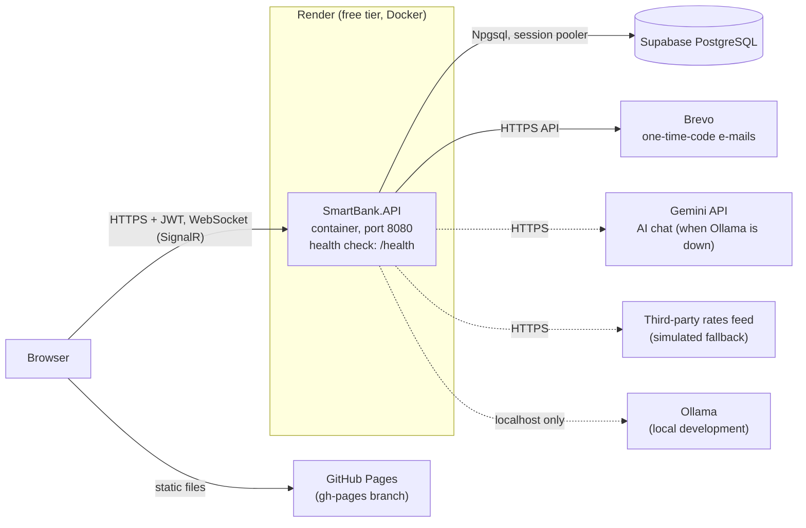
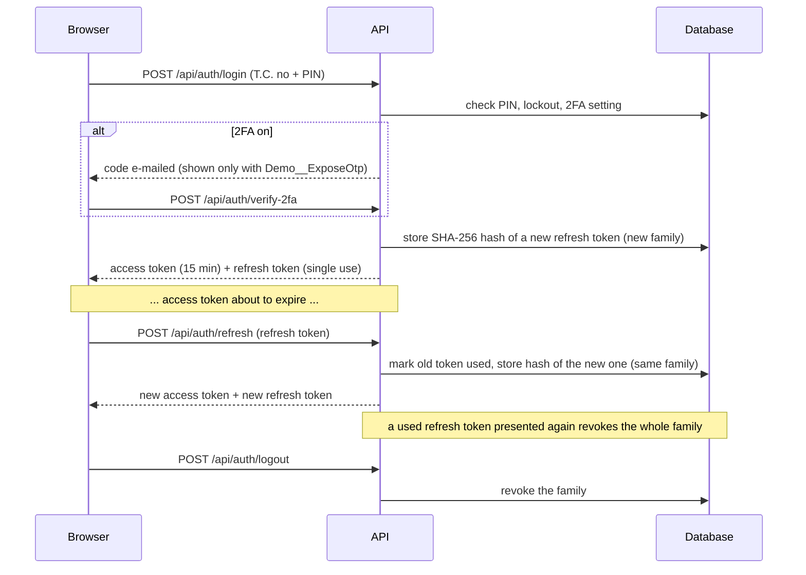

# Architecture

A short map of how SmartBank is put together. For the reasoning behind individual decisions see
[`DEFENSE.md`](DEFENSE.md) (in Turkish, with an English summary at the top); for configuration see the README.

## Layers

```
src/
  SmartBank.Core            entities, DTOs, interfaces, validators and the pure security rules
                            (one-time codes, login lockout, card masking, encryption helper, T.C. Kimlik No check)
  SmartBank.Infrastructure  EF Core DbContext and migrations, services (banking, auth, chat, market rates, e-mail),
                            the standing-order background worker, JWT settings
  SmartBank.API             ASP.NET Core host: controllers, SignalR hub, middleware, rate limiting, CORS, health checks
  SmartBank.Web             static frontend (HTML, CSS, vanilla JavaScript), published to GitHub Pages
  SmartBank.Tests           xUnit: unit, real-database and whole-application integration tests
```

Dependencies point inwards: `API -> Infrastructure -> Core`; the tests reference all three. `Core` has no dependency on
EF Core or ASP.NET, which keeps the security rules testable without a database or a web server.

## Deployment topology



- The frontend is published with `scripts/deploy-pages.ps1` (or `.sh`) from `src/SmartBank.Web`; it is not served by the API.
- The API image is built from the `Dockerfile` (non-root, port 8080, forwarded headers on because Render terminates TLS).
- The production schema is **not** created by the application (it never calls `MigrateAsync`; with hand-made tables behind
  Supabase's connection pooler that would not be safe). It is created with `docs/deploy/00-baseline-postgres.sql` and upgraded with the numbered scripts in
  `docs/deploy`. `docs/deploy/schema-check.sql` lists the production columns for comparison with the model.
- Local development uses SQL Server LocalDB (the EF migrations target SQL Server) or the PostgreSQL container from
  `docker-compose.yml`. CI runs the real-database tests on PostgreSQL 16 and SQL Server 2022.

## Request flow

Every HTTP request passes through the same pipeline (`Program.cs`):

1. `GlobalExceptionMiddleware`: unhandled errors become a problem-details body with a trace id and no internals.
2. `SecurityHeadersMiddleware`: `nosniff`, `X-Frame-Options`, CSP `default-src 'none'`, `no-referrer`, `no-store` on `/api` and `/hubs`.
3. HSTS (production only), HTTPS redirection.
4. CORS with an explicit origin allow-list.
5. Authentication (JWT bearer): who is calling.
6. Rate limiting, after authentication on purpose so that per-user policies can see the user: per client IP for auth,
   refresh and market rates, per signed-in user (IP when anonymous) for the banking endpoints, and a stricter per-user
   policy for money-moving calls.
7. Authorization (roles `Customer` and `Agent`).
8. Controller or SignalR hub, which calls a service in `Infrastructure`.

Behind Render's proxy the client address comes from the forwarded headers (`ASPNETCORE_FORWARDEDHEADERS_ENABLED=true` in the
image, applied before the pipeline above); without it every client would share one rate-limit bucket.

Money movements (transfer, deposit, exchange, card payment and charge, account closing) go through one retry wrapper
in `BankingService`: every update is `WHERE Id = @id AND Version = @read`, and a conflict repeats the operation from fresh
reads. The standing-order worker (`StandingOrderExecutionWorker`) wakes every 30 seconds and executes due orders in
separate scopes and transactions.

## Authentication and refresh tokens



Roles live in the database and in the token; an `Agent` can only be created by an administrator with SQL. Logout revokes the
one session (family) it belongs to; a password reset revokes all of the user's sessions. Failed sign-ins and the account
lockout do **not** revoke sessions (v1.3): otherwise anyone who knew a T.C. number could keep signing its owner out. The
SignalR connection takes the access token through `accessTokenFactory` (query string
`access_token`, accepted only on `/hubs`).

## Support chat

The browser connects to the SignalR hub (`/hubs/support`). A customer message is stored, then answered by the AI bot:
FAQ retrieval (`RAGService`) feeds Ollama when it is reachable, otherwise Gemini. The model can only propose actions
(balance lookup, a transfer the customer must confirm); machine markers typed by users or produced by the model are made
inert on the server, and per-user size and rate limits apply to every hub method. An agent can take over a conversation.

## Where to look

| Question | Place |
|---|---|
| How do I run it, configure it, deploy it? | [`../README.md`](../README.md) |
| What changed in each release? | [`../CHANGELOG.md`](../CHANGELOG.md) |
| Why was it done this way? | [`DEFENSE.md`](DEFENSE.md) |
| Database scripts | [`deploy/`](deploy) |
